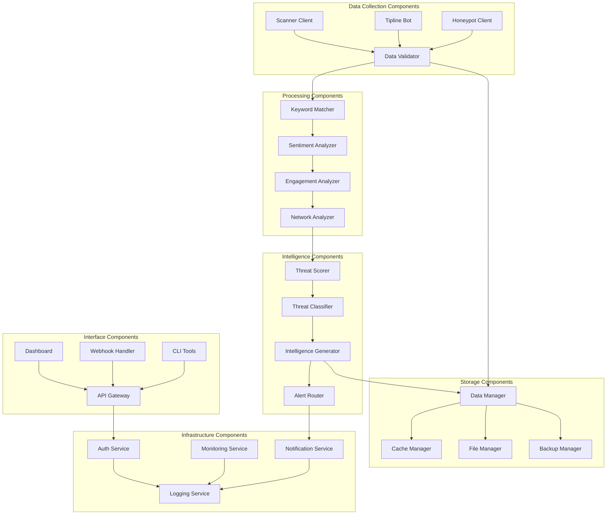

# System Components

## Component Architecture Overview

The Anti-India Campaign Detection System is composed of interconnected modules that work together to provide comprehensive threat detection and analysis capabilities. Each component is designed for modularity, testability, and independent scaling.



## Data Collection Components

### Scanner Client (SIGINT)

**Purpose**: Automated monitoring and data collection from public Telegram channels.


**Key Features**:
- **Concurrent Channel Monitoring**: Simultaneous monitoring of multiple channels
- **Rate Limit Management**: Intelligent API rate limiting to avoid restrictions
- **Connection Recovery**: Automatic reconnection and error recovery
- **Message Deduplication**: Prevention of duplicate message processing
- **Metadata Extraction**: Complete message metadata capture

**Configuration Example**:
```yaml
scanner:
  channels:
    - "@channel1"
    - "@channel2"
  rate_limit:
    requests_per_second: 10
    burst_limit: 20
  retry_policy:
    max_retries: 3
    backoff_multiplier: 2
```

### Tipline Bot (HUMINT)

**Purpose**: Crowdsourced intelligence collection through user submissions.


**Key Features**:
- **Anonymous Submissions**: Secure, anonymous tip submission system
- **Content Validation**: Automated validation of submitted intelligence
- **Multi-format Support**: Text, images, URLs, and document submissions
- **Feedback Loop**: Confirmation and follow-up with submitters
- **Priority Classification**: Automatic prioritization of high-value tips

### Honeypot Client (Advanced HUMINT)

**Purpose**: Covert intelligence collection from private groups and channels.


**Operational Security Features**:
- **Persona Management**: Maintains credible cover identities
- **Behavioral Patterns**: Human-like interaction patterns
- **Content Filtering**: Selective intelligence extraction
- **Operational Security**: Maintains cover and avoids detection
- **Evidence Chain**: Maintains evidence integrity for legal proceedings

## Processing Components

### Keyword Matcher

**Purpose**: Initial content filtering based on threat-related keywords and phrases.


**Keyword Categories**:
- **Geographic Terms**: India-specific locations and regions
- **Political Keywords**: Government, policy, and political terms
- **Religious/Cultural**: Terms related to religious and cultural tensions
- **Violence Indicators**: Terms suggesting potential violence or unrest
- **Propaganda Markers**: Common propaganda and disinformation indicators

### Sentiment Analyzer

**Purpose**: Emotional tone analysis to prioritize hostile content.


**Analysis Capabilities**:
- **Multi-language Support**: Hindi, English, and regional language analysis
- **Context Awareness**: Understanding of cultural and regional context
- **Emotion Detection**: Beyond sentiment to specific emotional states
- **Confidence Scoring**: Reliability assessment for each analysis
- **Batch Processing**: Efficient processing of large message volumes

### Engagement Analyzer

**Purpose**: Tracking message spread, influence, and viral potential.


**Engagement Metrics**:
- **Reach Analysis**: Total audience exposure calculation
- **Velocity Tracking**: Speed of message propagation
- **Influence Scoring**: Author and message influence assessment
- **Network Effects**: Cross-channel amplification detection
- **Viral Prediction**: Early viral spread prediction algorithms

## Intelligence Components

### Threat Scorer

**Purpose**: Quantitative threat assessment combining multiple analysis factors.


**Scoring Algorithm**:
$$ThreatScore = \sum_{i=1}^{n} w_i \times f_i \times c_i \times t_i$$

Where:
- $w_i$ = Weight for factor $i$
- $f_i$ = Factor score (normalized 0-1)
- $c_i$ = Context multiplier
- $t_i$ = Temporal multiplier

### Threat Classifier

**Purpose**: Categorical classification of threats based on type and severity.


## Storage Components

### Data Manager

**Purpose**: Centralized data access and persistence management.


### Cache Manager

**Purpose**: High-performance data caching for frequently accessed information.

**Caching Strategy**:
- **Hot Data**: Recent messages and active threats (Redis)
- **Warm Data**: Historical analysis results (Database with indexing)
- **Cold Data**: Archived messages and reports (File system)

**Cache Patterns**:
- **Write-through**: Immediate cache update on data modification
- **Read-aside**: Cache population on cache miss
- **TTL-based Expiration**: Automatic cache invalidation
- **Cache Warming**: Proactive cache population for predictable access patterns

## Interface Components

### Dashboard Component

**Purpose**: Interactive web interface for threat visualization and analysis.


**Dashboard Features**:
- **Real-time Updates**: Live data streaming and automatic refresh
- **Interactive Visualizations**: Plotly-based charts and graphs
- **Customizable Views**: User-configurable dashboard layouts
- **Export Capabilities**: PDF, Excel, and CSV export options
- **Mobile Responsive**: Optimized for desktop and mobile access

### API Gateway

**Purpose**: Centralized API management and external system integration.

**API Endpoints**:
- **Authentication**: `/api/v1/auth/*`
- **Messages**: `/api/v1/messages/*`
- **Analysis**: `/api/v1/analysis/*`
- **Alerts**: `/api/v1/alerts/*`
- **Reports**: `/api/v1/reports/*`
- **Administration**: `/api/v1/admin/*`

**API Features**:
- **RESTful Design**: Standard HTTP methods and status codes
- **OpenAPI Documentation**: Comprehensive API documentation
- **Rate Limiting**: Request throttling and quota management
- **Authentication**: JWT-based authentication with role-based access
- **Versioning**: Backward-compatible API versioning

This comprehensive component architecture ensures the system's modularity, scalability, and maintainability while providing the robust functionality needed for effective threat detection and intelligence analysis.
