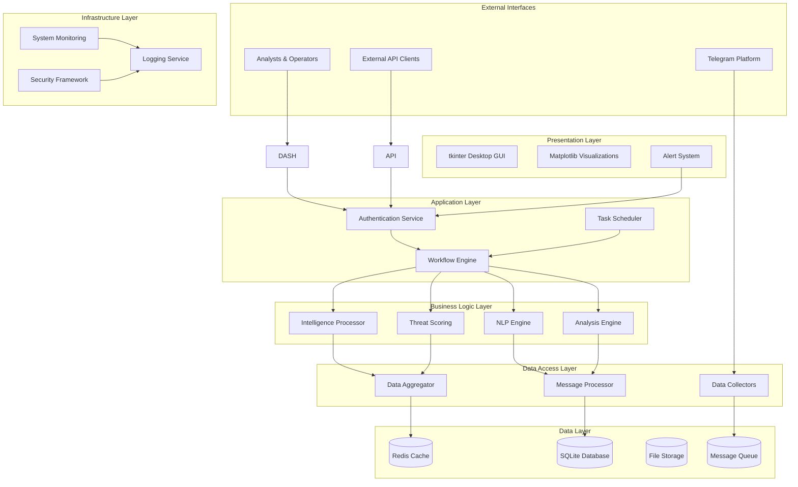
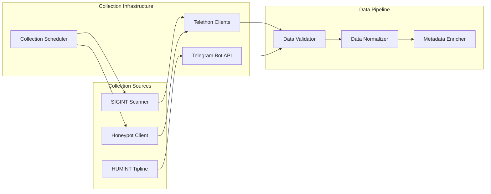
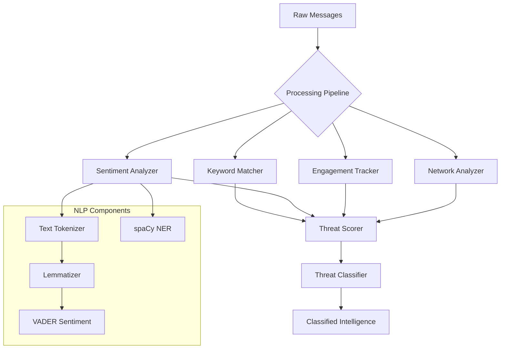
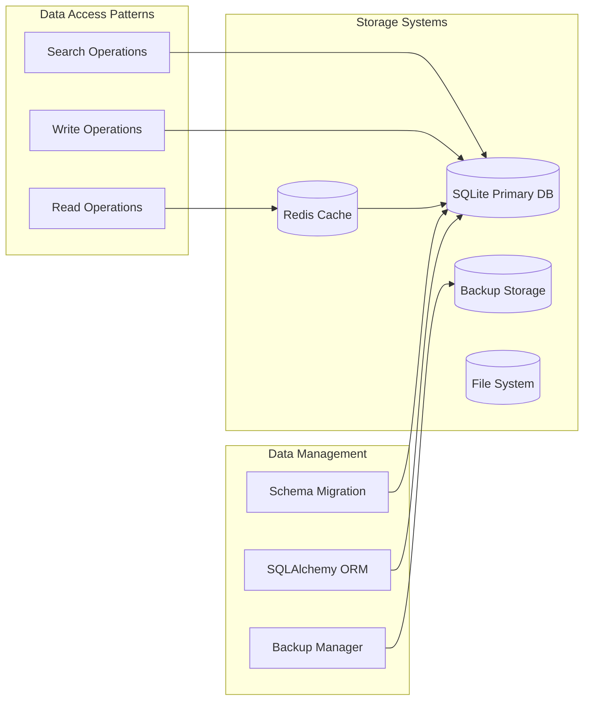
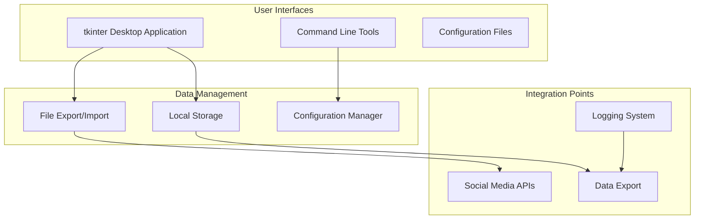
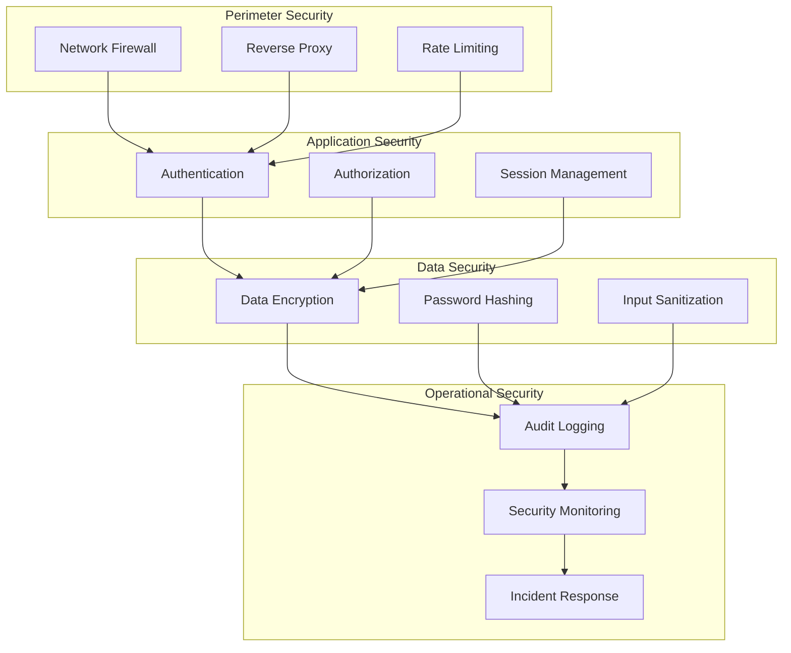
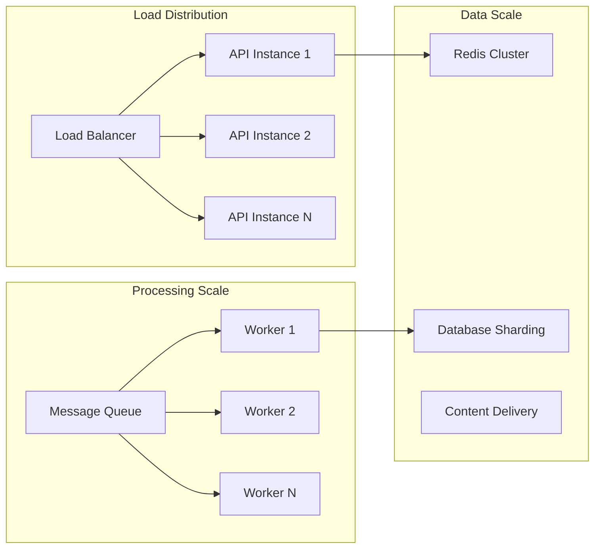
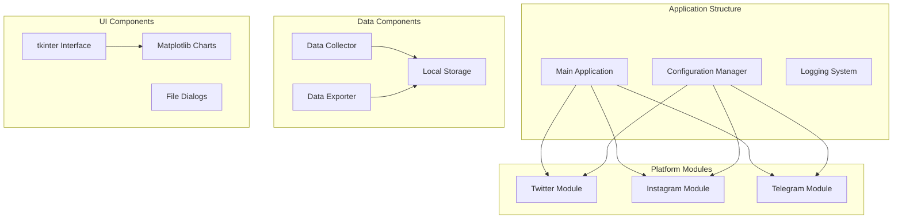

# Architecture Overview

## System Architecture Philosophy

The Anti-India Campaign Detection System is built on a **modular, layered architecture** that prioritizes scalability, maintainability, and security. The design follows enterprise software development principles while maintaining the flexibility needed for intelligence operations.

## High-Level Architecture

## Architectural Layers

### 1. Data Collection Layer

The foundation layer responsible for gathering intelligence from multiple sources:

#### Components:
- **Public Scanner**: Automated monitoring of public Telegram channels
- **Tipline Bot**: Interface for crowdsourced intelligence reporting
- **Honeypot Client**: Covert intelligence gathering from private groups
- **Data Validation**: Ensures data quality and consistency
- **Metadata Enrichment**: Adds contextual information to collected data

### 2. Processing and Analysis Layer

The core intelligence engine that transforms raw data into actionable insights:

#### Core Processing Components:

1. **Keyword Detection Engine**
   - Dynamic keyword matching against threat database
   - Multi-language support with translation capabilities
   - Regular expression pattern matching for complex terms
   - Contextual keyword analysis to reduce false positives

2. **Natural Language Processing Suite**
   - **Sentiment Analysis**: VADER-based emotional tone classification
   - **Named Entity Recognition**: Identification of persons, locations, organizations
   - **Language Detection**: Automatic language identification and processing
   - **Text Classification**: Automated categorization of message content

3. **Engagement Analysis Engine**
   - Forward tracking and viral spread detection
   - Influence scoring based on message reach and interaction
   - Temporal analysis of message velocity and momentum
   - Cross-channel correlation and amplification detection

### 3. Storage and Data Management Layer

Efficient and secure data management infrastructure:

#### Storage Architecture:
- **Primary Database**: SQLite for structured data storage
- **Cache Layer**: Redis for high-performance data access
- **File Storage**: Organized file system for documents and media
- **Backup System**: Automated backup and recovery mechanisms

### 4. Presentation and Interface Layer

User-facing components and external integrations:

## Security Architecture

### Multi-Layer Security Model

### Security Components:
- **Authentication**: Multi-factor authentication with SSO integration
- **Authorization**: Role-based access control (RBAC) with fine-grained permissions
- **Data Protection**: End-to-end encryption for sensitive intelligence data
- **Audit Trail**: Comprehensive logging of all system activities
- **Operational Security**: Secure handling of HUMINT assets and sensitive operations

## Scalability and Performance

### Horizontal Scaling Strategy

### Performance Optimizations:
- **Asynchronous Processing**: Non-blocking I/O for high-throughput data collection
- **Message Queuing**: Celery-based distributed task processing
- **Caching Strategy**: Multi-tier caching for frequently accessed data
- **Database Optimization**: Indexed queries and connection pooling

## Deployment Architecture

### Container-Based Deployment

### Application Components:
- **Desktop Application**: Single executable tkinter application
- **Orchestration**: Kubernetes for automated scaling and management
- **Service Discovery**: Automatic service registration and discovery
- **Health Monitoring**: Comprehensive system health checks and alerting

This architecture ensures the system can handle the demanding requirements of real-time intelligence processing while maintaining security, reliability, and scalability for mission-critical operations.
