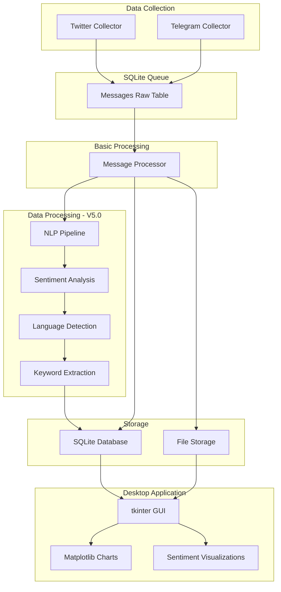

# Architecture Overview

## Simple Prototype Architecture
The Anti-India Campaign Detector is a research prototype with a simple, straightforward architecture. It focuses on data collection and basic storage using SQLite, with a tkinter desktop application for user interface.

### Architecture Flow



## Core Components

### Data Collection
- **Twitter Collector**: Uses Playwright for browser automation, with Twitter API as fallback
- **Telegram Collector**: Collects messages from Telegram channels/groups using Bot API

### Data Storage
- **SQLite Queue**: Simple database table storing raw collected messages
- **SQLite Database**: Processed and organized data storage
- **File Storage**: Optional file system storage for media and exports

### User Interface
- **tkinter Desktop GUI**: Simple desktop application for configuration and monitoring
- **Matplotlib Visualizations**: Basic charts and graphs for data analysis

### Processing
- **Message Processor**: Basic processing of collected messages (cleaning, formatting, storage)
- **Data Processing Layer (V5.0)**: Advanced NLP processing pipeline with sentiment analysis, language detection, and keyword extraction

## Technical Details

### Desktop Application Features
- Configuration management for API keys and settings
- Real-time monitoring of data collection progress
- Basic data visualization with matplotlib
- Export functionality for collected data
- Simple queue management interface

### Database Schema
- **Raw Messages Table**: Stores unprocessed collected data
- **Processed Messages Table**: Stores cleaned and organized data
- **Configuration Table**: Stores application settings and preferences
- **Logs Table**: Stores application logs and error messages

### File Storage Structure
```
data/
├── exports/          # Exported data files (CSV, JSON)
├── logs/            # Application log files
├── config/          # Configuration files
└── temp/            # Temporary processing files
```

This simple architecture ensures the prototype is easy to understand, deploy, and use for research purposes while maintaining the flexibility to add more complex features in the future.
