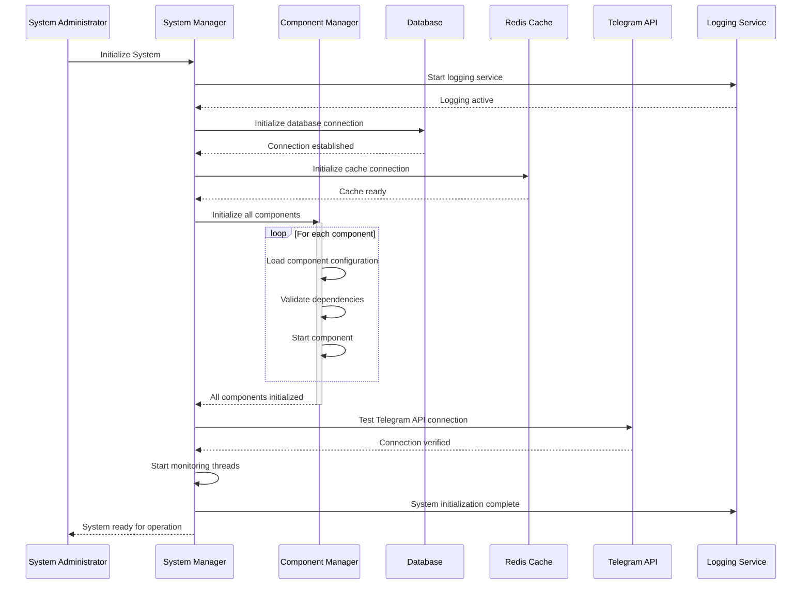
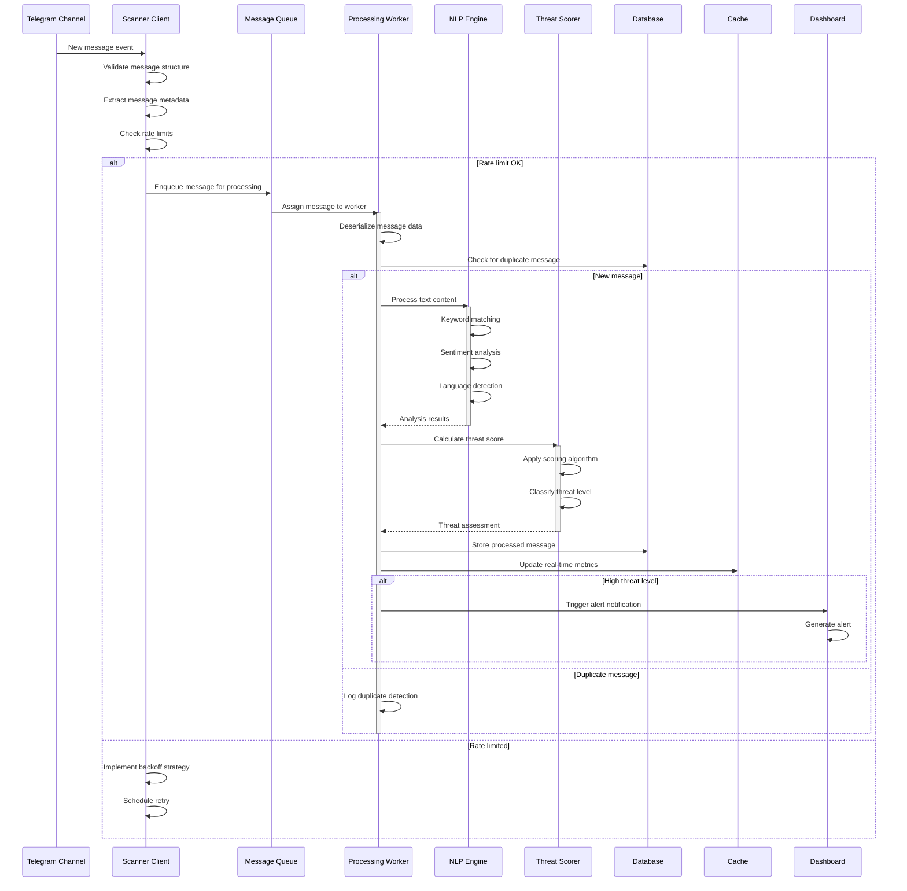
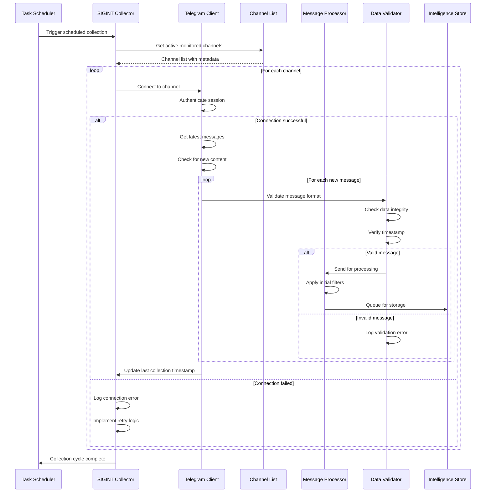
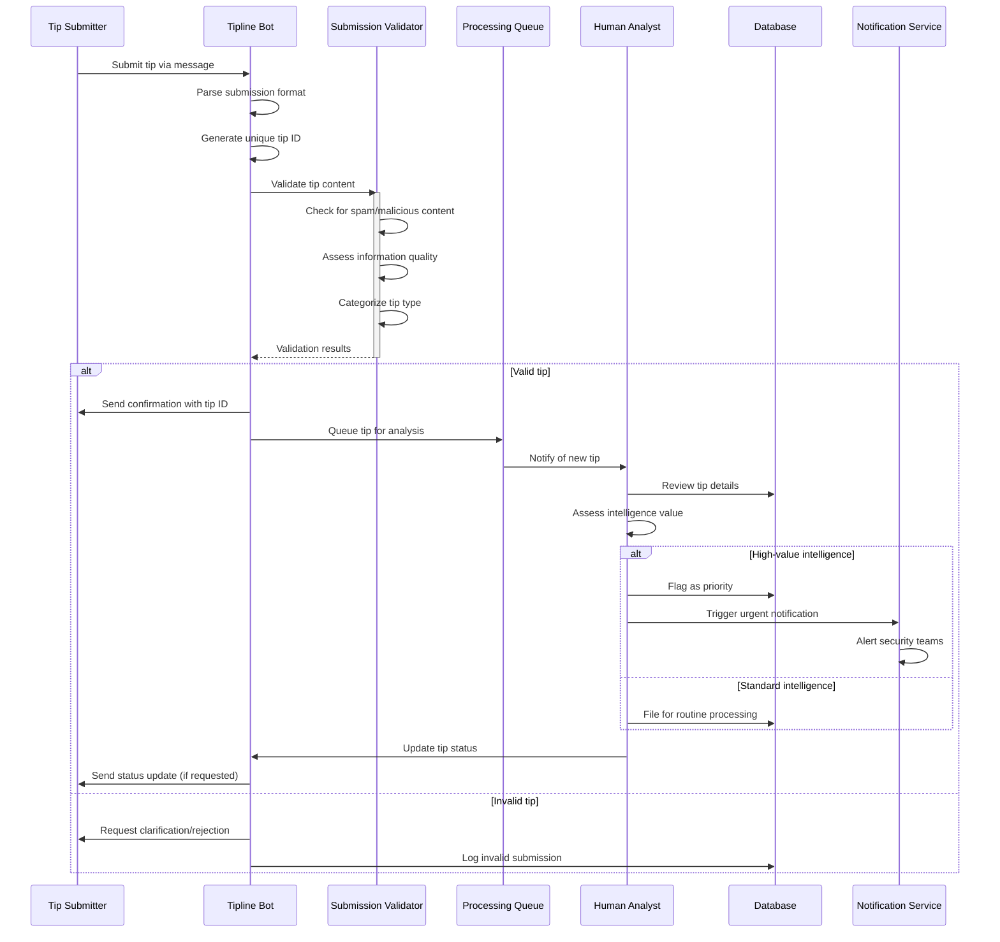
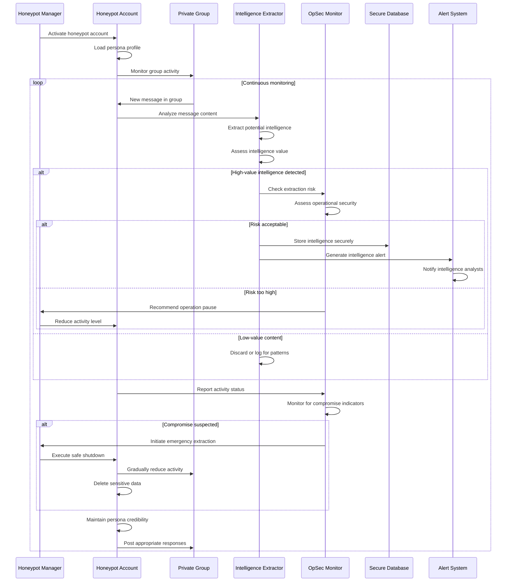
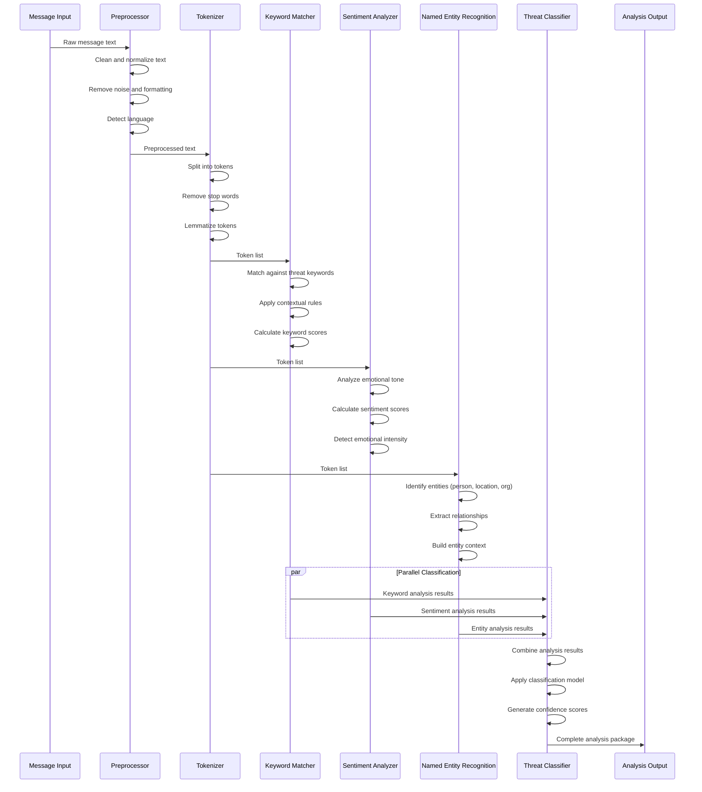
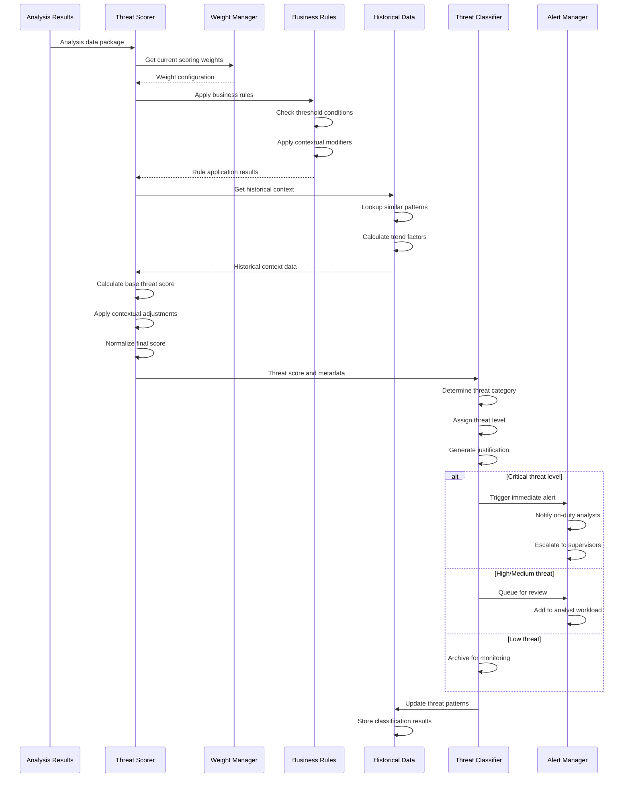
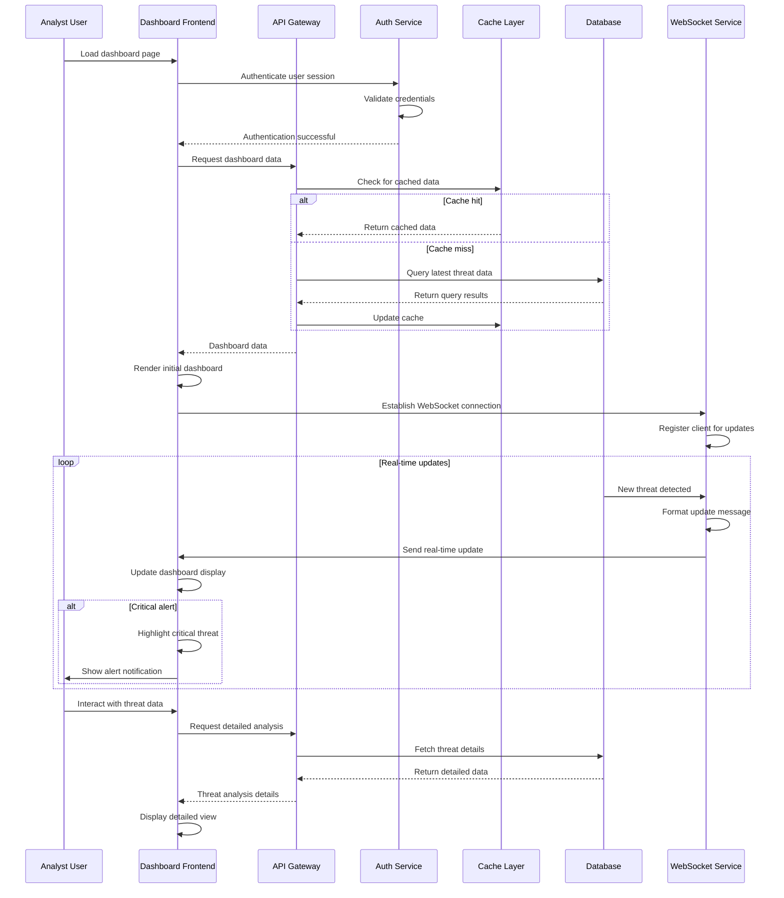
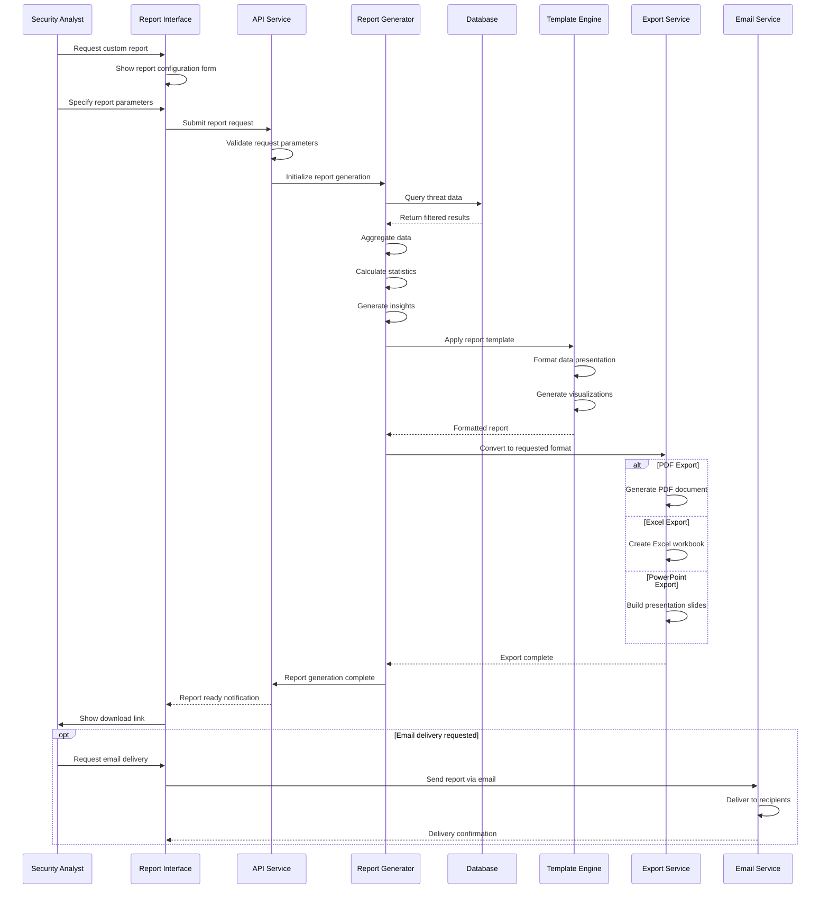
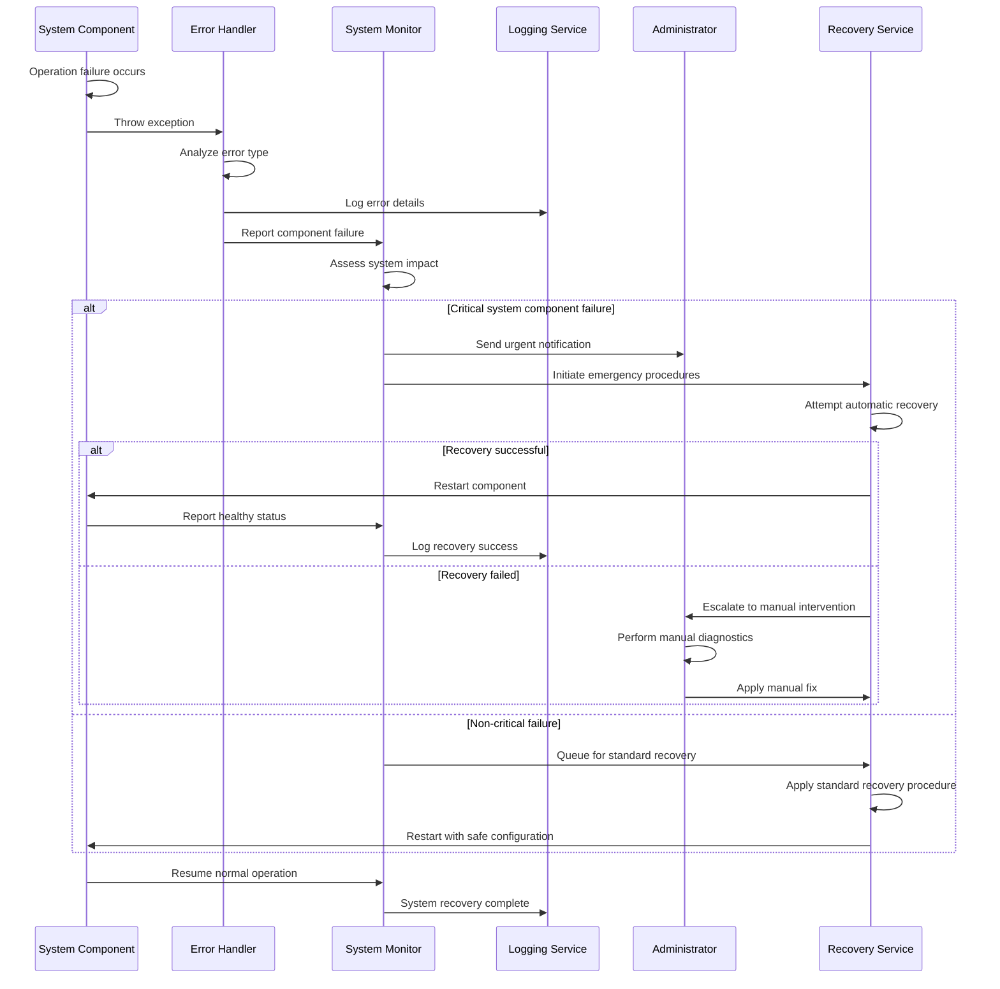

# Sequence Diagrams

## Comprehensive System Interaction Flows

This section provides detailed sequence diagrams illustrating the temporal interactions between system components, external services, and users throughout various operational scenarios.

## Core System Operations

### System Initialization Sequence

### Message Collection and Processing Pipeline

## Intelligence Collection Workflows

### SIGINT Collection Sequence

### HUMINT Tipline Operation

### Honeypot Intelligence Extraction

## Analysis and Threat Assessment

### NLP Analysis Pipeline

### Threat Scoring and Classification

## User Interface and Reporting

### Dashboard Real-time Updates

### Report Generation Workflow

## Error Handling and Recovery

### System Error Recovery Sequence

These sequence diagrams provide detailed insights into the temporal behavior of the system, showing how components interact during various operational scenarios. They serve as essential documentation for understanding system behavior, debugging issues, and ensuring proper implementation of complex workflows.
