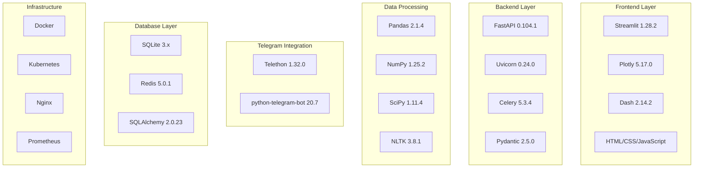
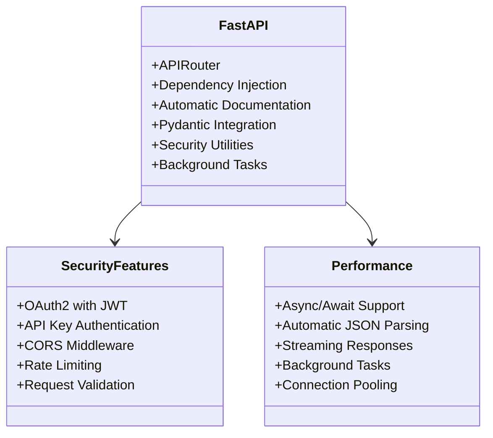
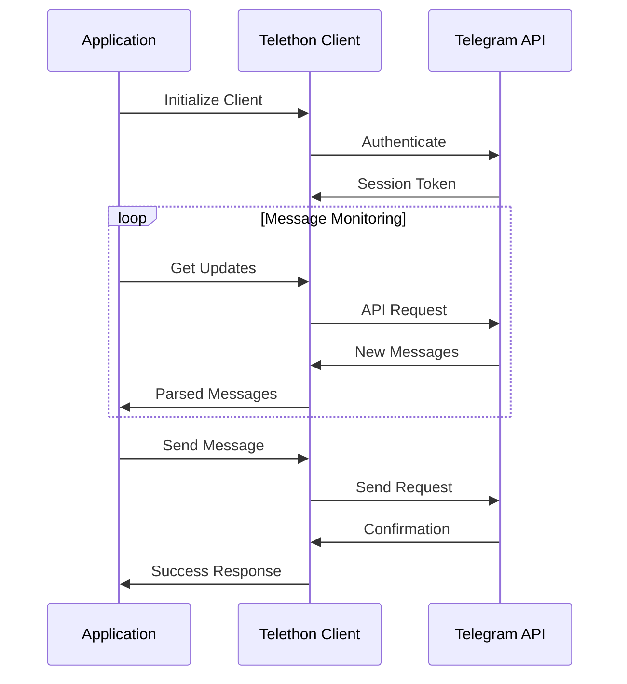
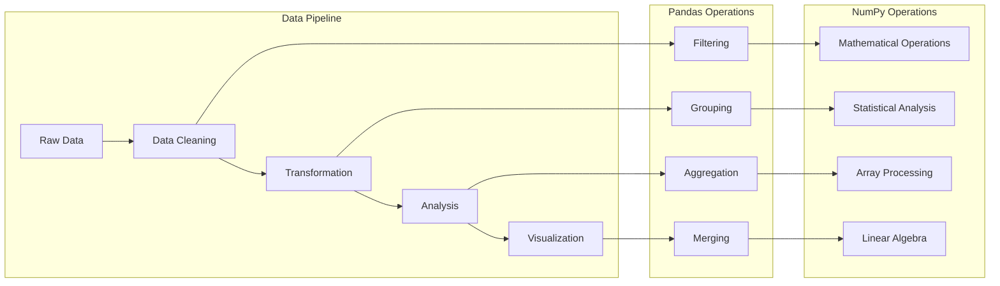
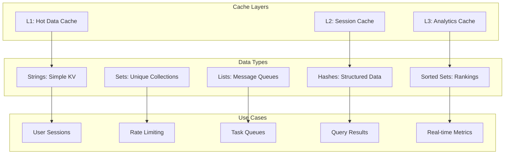
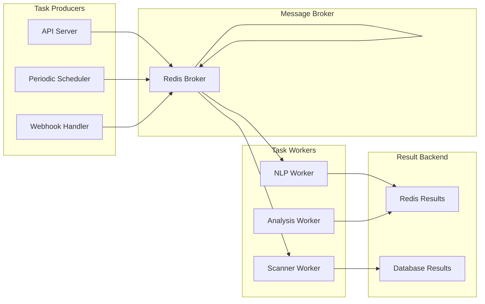

# Technology Stack

## Technology Selection Criteria

The technology stack for the Anti-India Campaign Detection System has been carefully selected based on the following criteria:

- **Security**: Robust security features and active vulnerability management
- **Scalability**: Ability to handle increasing data volumes and user loads
- **Reliability**: Proven stability in production environments
- **Performance**: Low latency and high throughput capabilities
- **Community Support**: Active development community and comprehensive documentation
- **Integration**: Compatibility with existing security infrastructure
- **Compliance**: Adherence to government and security standards

## Core Technology Architecture



## Programming Language and Runtime

### Python 3.9+

**Selection Rationale**:
- **Mature Ecosystem**: Extensive libraries for data science and NLP
- **Security Libraries**: Comprehensive cryptographic and security tooling
- **Performance**: Sufficient performance with optimization opportunities
- **Government Adoption**: Widely used in government and intelligence applications
- **Maintainability**: Clear syntax and excellent debugging tools

**Key Features Utilized**:
- **Asyncio**: Asynchronous programming for high-concurrency operations
- **Type Hints**: Static type checking for improved code quality
- **Context Managers**: Resource management for database and API connections
- **Dataclasses**: Structured data representation
- **Pathlib**: Cross-platform file system operations

## Web Framework and API

### FastAPI 0.104.1



**Key Benefits**:
- **High Performance**: One of the fastest Python web frameworks
- **Security-First**: Built-in security features and best practices
- **API Documentation**: Automatic OpenAPI/Swagger documentation
- **Type Safety**: Integration with Pydantic for request/response validation
- **Async Support**: Native asynchronous request handling

**Security Configuration**:
```python
from fastapi import FastAPI, Depends, HTTPException
from fastapi.security import HTTPBearer, HTTPAuthorizationCredentials
from fastapi.middleware.cors import CORSMiddleware
from fastapi.middleware.trustedhost import TrustedHostMiddleware

app = FastAPI(
    title="Anti-India Campaign Detection API",
    version="1.0.0",
    docs_url="/docs",
    redoc_url="/redoc"
)

# Security Middleware
app.add_middleware(
    TrustedHostMiddleware,
    allowed_hosts=["api.security.gov", "*.security.gov"]
)

app.add_middleware(
    CORSMiddleware,
    allow_origins=["https://dashboard.security.gov"],
    allow_methods=["GET", "POST", "PUT", "DELETE"],
    allow_headers=["Authorization", "Content-Type"]
)
```

### Uvicorn 0.24.0

**ASGI Server Features**:
- **HTTP/2 Support**: Modern protocol support for improved performance
- **WebSocket Support**: Real-time communication capabilities
- **SSL/TLS**: Secure communication with automatic certificate management
- **Process Management**: Automatic worker process management
- **Hot Reload**: Development convenience with automatic code reloading

## Telegram Integration

### Telethon 1.32.0



**Capabilities**:
- **Full API Access**: Complete Telegram API functionality
- **Session Management**: Persistent authentication sessions
- **Rate Limit Handling**: Automatic rate limit management
- **Error Recovery**: Robust error handling and reconnection
- **Message Parsing**: Comprehensive message and media parsing

**Security Features**:
- **MTProto Encryption**: Native Telegram encryption protocol
- **Session Encryption**: Encrypted session storage
- **API Hash Protection**: Secure API credential management
- **Proxy Support**: SOCKS and HTTP proxy support for anonymity

### Python-Telegram-Bot 20.7

**Bot Framework Features**:
- **Webhook Support**: Efficient webhook-based message handling
- **Handler System**: Event-driven message and callback handling
- **Inline Keyboards**: Rich user interface components
- **File Handling**: Support for document, image, and media processing
- **Admin Controls**: Bot administration and management features

## Data Processing and Analytics

### Pandas 2.1.4 & NumPy 1.25.2



**Data Processing Capabilities**:
- **Time Series Analysis**: Temporal pattern detection and analysis
- **Statistical Operations**: Comprehensive statistical functions
- **Data Transformation**: ETL operations for data preparation
- **Performance Optimization**: Vectorized operations for large datasets
- **Memory Management**: Efficient memory usage for large datasets

### Natural Language Processing Stack

#### NLTK 3.8.1
- **Tokenization**: Advanced text tokenization and sentence segmentation
- **Corpus Access**: Pre-built corpora and linguistic resources
- **Language Processing**: Stemming, lemmatization, and part-of-speech tagging
- **Sentiment Lexicons**: Built-in sentiment analysis dictionaries

#### spaCy 3.7.2
- **Named Entity Recognition**: Identification of persons, organizations, locations
- **Dependency Parsing**: Grammatical relationship analysis
- **Language Models**: Pre-trained models for multiple languages
- **Custom Training**: Ability to train domain-specific models

#### VADER Sentiment 3.3.2
```python
from vaderSentiment.vaderSentiment import SentimentIntensityAnalyzer

class ThreatSentimentAnalyzer:
    def __init__(self):
        self.analyzer = SentimentIntensityAnalyzer()
        
    def analyze_threat_level(self, text: str) -> dict:
        """Analyze text for threat-related sentiment"""
        scores = self.analyzer.polarity_scores(text)
        
        # Customize for threat detection
        threat_indicators = {
            'hostility': scores['neg'] * 1.2,  # Weight negative sentiment higher
            'intensity': abs(scores['compound']),  # Absolute intensity matters
            'confidence': self._calculate_confidence(scores),
            'threat_level': self._classify_threat(scores)
        }
        
        return threat_indicators
```

## Database and Storage

### SQLite 3.x

**Selection Rationale**:
- **Embedded Database**: No separate database server required
- **ACID Compliance**: Full transaction support with data integrity
- **Performance**: Excellent read performance for analytical workloads
- **Simplicity**: Zero-configuration database with minimal maintenance
- **Government Approved**: Widely approved for government applications

**Schema Design**:
```sql
-- Messages table with full-text search
CREATE TABLE messages (
    id INTEGER PRIMARY KEY,
    telegram_id BIGINT UNIQUE,
    channel_id TEXT,
    content TEXT,
    timestamp DATETIME,
    metadata JSON,
    threat_score REAL,
    analysis_results JSON,
    created_at DATETIME DEFAULT CURRENT_TIMESTAMP
);

-- Full-text search index
CREATE VIRTUAL TABLE messages_fts USING fts5(
    content, 
    channel_id, 
    content='messages', 
    content_rowid='id'
);

-- Channels tracking table
CREATE TABLE channels (
    id TEXT PRIMARY KEY,
    name TEXT,
    description TEXT,
    subscriber_count INTEGER,
    monitoring_active BOOLEAN,
    last_message_id BIGINT,
    risk_level INTEGER,
    created_at DATETIME DEFAULT CURRENT_TIMESTAMP
);
```

### Redis 5.0.1

**Caching Strategy**:


## Task Queue and Background Processing

### Celery 5.3.4

**Distributed Task Architecture**:


**Task Categories**:
- **Message Processing**: NLP analysis and threat scoring
- **Data Collection**: Channel scanning and message extraction
- **Analytics**: Report generation and trend analysis
- **Maintenance**: Database cleanup and optimization
- **Notifications**: Alert delivery and user notifications

## Visualization and Dashboard

### Streamlit 1.28.2

**Dashboard Components**:
```python
import streamlit as st
import plotly.express as px
import plotly.graph_objects as go

class ThreatDashboard:
    def __init__(self):
        self.setup_page_config()
        
    def setup_page_config(self):
        st.set_page_config(
            page_title="Anti-India Campaign Detector",
            page_icon="🛡️",
            layout="wide",
            initial_sidebar_state="expanded"
        )
        
    def render_threat_overview(self):
        col1, col2, col3, col4 = st.columns(4)
        
        with col1:
            st.metric("Active Threats", "127", "↑23")
        with col2:
            st.metric("Channels Monitored", "543", "↑12")
        with col3:
            st.metric("Messages Today", "15.2K", "↑2.1K")
        with col4:
            st.metric("Avg Threat Score", "0.34", "↓0.05")
```

### Plotly 5.17.0

**Visualization Capabilities**:
- **Interactive Charts**: Zoom, pan, and drill-down functionality
- **Real-time Updates**: Live data streaming and automatic refresh
- **Custom Themes**: Government-compliant color schemes and branding
- **Export Options**: High-quality image and PDF export
- **Mobile Responsive**: Optimized for various screen sizes

## Infrastructure and Deployment

### Containerization with Docker

```dockerfile
# Production Dockerfile
FROM python:3.11-slim

WORKDIR /app

# Security: Create non-root user
RUN adduser --disabled-password --gecos '' appuser

# Install dependencies
COPY requirements.txt .
RUN pip install --no-cache-dir -r requirements.txt

# Copy application
COPY . .
RUN chown -R appuser:appuser /app

USER appuser

EXPOSE 8000

CMD ["uvicorn", "main:app", "--host", "0.0.0.0", "--port", "8000"]
```

### Kubernetes Orchestration

```yaml
apiVersion: apps/v1
kind: Deployment
metadata:
  name: aicd-api
spec:
  replicas: 3
  selector:
    matchLabels:
      app: aicd-api
  template:
    metadata:
      labels:
        app: aicd-api
    spec:
      containers:
      - name: api
        image: security-intel/aicd-api:latest
        ports:
        - containerPort: 8000
        env:
        - name: DATABASE_URL
          valueFrom:
            secretKeyRef:
              name: db-secret
              key: url
        resources:
          requests:
            memory: "256Mi"
            cpu: "250m"
          limits:
            memory: "512Mi"
            cpu: "500m"
```

## Security and Monitoring

### Security Stack
- **Cryptography 41.0.7**: Encryption and cryptographic operations
- **Passlib**: Password hashing and verification
- **Python-JOSE**: JWT token generation and validation
- **HTTPX**: Secure HTTP client with certificate verification

### Monitoring Stack
- **Prometheus**: Metrics collection and alerting
- **Grafana**: Visualization and monitoring dashboards
- **Loguru**: Structured logging with security features
- **APM Tools**: Application performance monitoring

This comprehensive technology stack provides the foundation for a secure, scalable, and maintainable intelligence analysis platform capable of handling the demanding requirements of national security operations.
