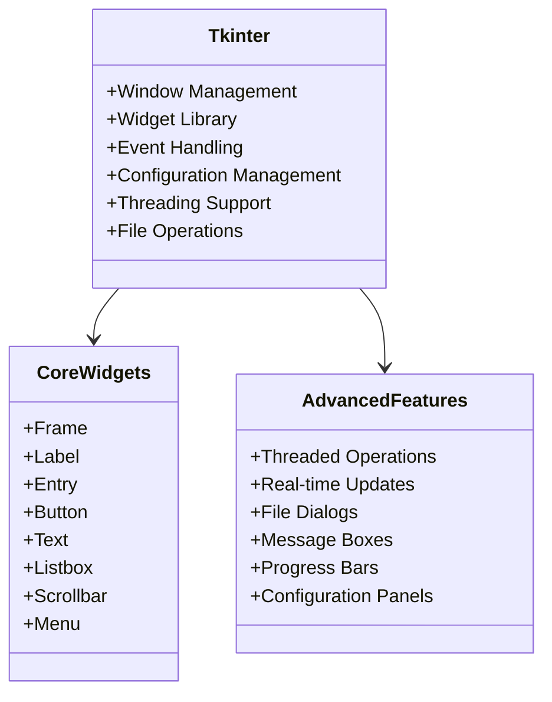
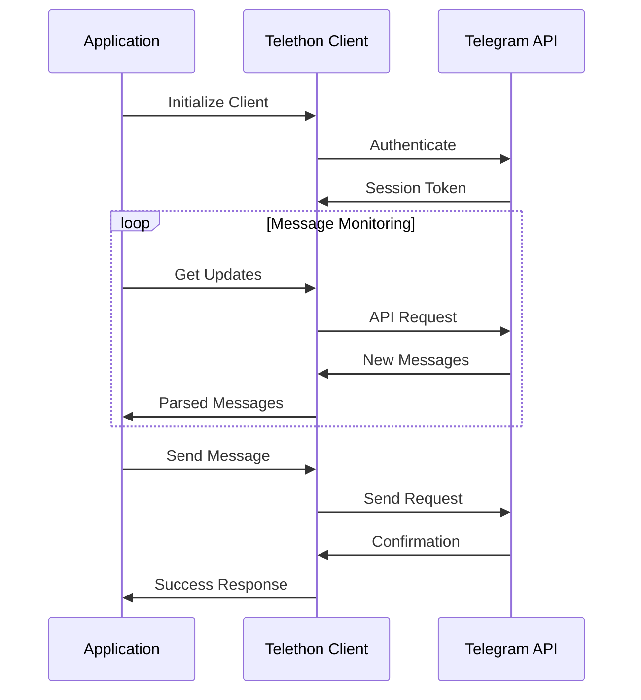
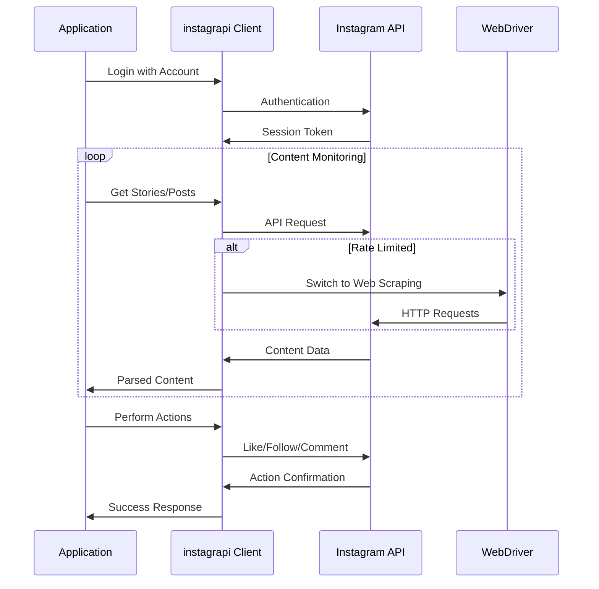
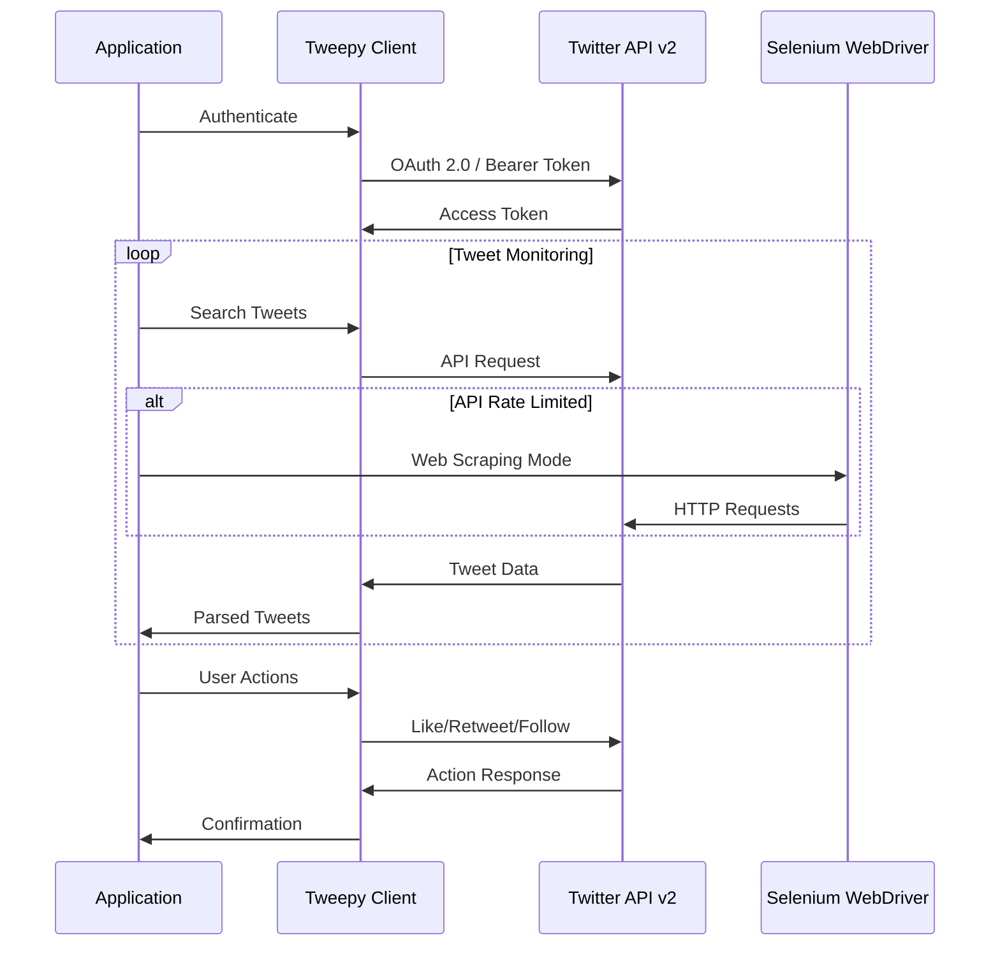
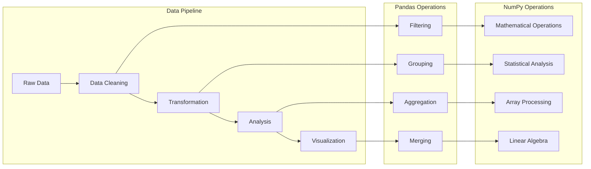
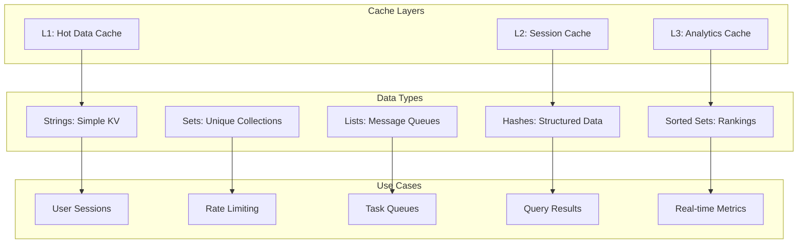
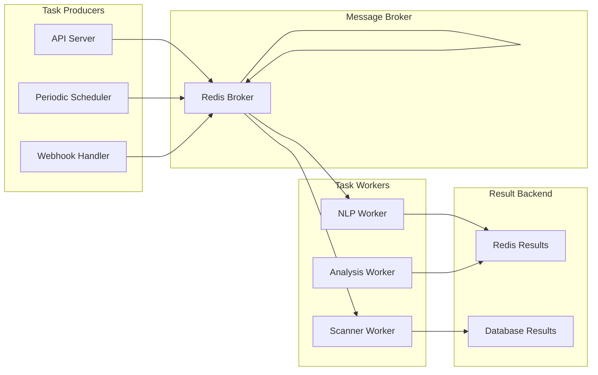

# Technology Stack

## Technology Selection Criteria

The technology stack for the Anti-India Campaign Detection System has been carefully selected based on the following criteria:

- **Security**: Robust security features and active vulnerability management
- **Scalability**: Ability to handle increasing data volumes and user loads
- **Reliability**: Proven stability in production environments
- **Performance**: Low latency and high throughput capabilities
- **Community Support**: Active development community and comprehensive documentation
- **Integration**: Compatibility with existing security infrastructure
- **Compliance**: Adherence to government and security standards

## Core Technology Architecture

```mermaid
graph TB
    subgraph "User Interface Layer"
        TKINTER[tkinter (Built-in)]
        MATPLOTLIB[Matplotlib 3.7.0]
        PILLOW[Pillow 10.0.0]
    end
    
    subgraph "Application Layer"
        THREADING[Threading Module]
        CONFIGPARSER[ConfigParser]
        LOGGING[Logging Module]
        ASYNCIO[AsyncIO]
    end
    
    subgraph "Data Processing"
        PANDAS[Pandas 2.1.4]
        NUMPY[NumPy 1.25.2]
        SCIPY[SciPy 1.11.4]
        NLTK[NLTK 3.8.1]
    end
    
    subgraph "Social Media Integration"
        TELETHON[Telethon 1.32.0]
        PTB[python-telegram-bot 20.7]
        INSTAGRAPI[instagrapi 2.0.0]
        TWEEPY[tweepy 4.14.0]
        SELENIUM[selenium 4.15.0]
    end
    
    subgraph "Database Layer"
        SQLITE[SQLite 3.x]
        REDIS[Redis 5.0.1]
        SQLALCHEMY[SQLAlchemy 2.0.23]
    end
    
    subgraph "Infrastructure"
        DOCKER[Docker]
        KUBERNETES[Kubernetes]
        NGINX[Nginx]
        PROMETHEUS[Prometheus]
    end
```

## Programming Language and Runtime

### Python 3.9+

**Selection Rationale**:
- **Mature Ecosystem**: Extensive libraries for data science and NLP
- **Security Libraries**: Comprehensive cryptographic and security tooling
- **Performance**: Sufficient performance with optimization opportunities
- **Government Adoption**: Widely used in government and intelligence applications
- **Maintainability**: Clear syntax and excellent debugging tools

**Key Features Utilized**:
- **Asyncio**: Asynchronous programming for high-concurrency operations
- **Type Hints**: Static type checking for improved code quality
- **Context Managers**: Resource management for database and API connections
- **Dataclasses**: Structured data representation
- **Pathlib**: Cross-platform file system operations

## User Interface Framework

### tkinter (Built-in Python GUI Toolkit)



**Key Benefits**:
- **Built-in**: No additional installation required with Python
- **Cross-platform**: Works on Windows, macOS, and Linux
- **Lightweight**: Minimal resource consumption
- **Reliable**: Mature and stable GUI framework
- **Simple**: Easy to learn and implement

**Application Structure**:
```python
import tkinter as tk
from tkinter import ttk, messagebox, filedialog
import threading
import configparser

class AntiIndiaCampaignDetector:
    def __init__(self):
        self.root = tk.Tk()
        self.root.title("Anti-India Campaign Detector")
        self.setup_ui()
        self.load_config()
    
    def setup_ui(self):
        # Main application interface
        self.notebook = ttk.Notebook(self.root)
        
        # Platform tabs
        self.twitter_frame = ttk.Frame(self.notebook)
        self.instagram_frame = ttk.Frame(self.notebook)
        self.telegram_frame = ttk.Frame(self.notebook)
        
        self.notebook.add(self.twitter_frame, text="Twitter")
        self.notebook.add(self.instagram_frame, text="Instagram") 
        self.notebook.add(self.telegram_frame, text="Telegram")
```

## Social Media Platform Integration

### Telegram Integration

### Telethon 1.32.0



**Capabilities**:
- **Full API Access**: Complete Telegram API functionality
- **Session Management**: Persistent authentication sessions
- **Rate Limit Handling**: Automatic rate limit management
- **Error Recovery**: Robust error handling and reconnection
- **Message Parsing**: Comprehensive message and media parsing

**Security Features**:
- **MTProto Encryption**: Native Telegram encryption protocol
- **Session Encryption**: Encrypted session storage
- **API Hash Protection**: Secure API credential management
- **Proxy Support**: SOCKS and HTTP proxy support for anonymity

### Python-Telegram-Bot 20.7

**Bot Framework Features**:
- **Webhook Support**: Efficient webhook-based message handling
- **Handler System**: Event-driven message and callback handling
- **Inline Keyboards**: Rich user interface components
- **File Handling**: Support for document, image, and media processing
- **Admin Controls**: Bot administration and management features

### Instagram Integration

### instagrapi 2.0.0



**Key Capabilities**:
- **Story Monitoring**: Real-time story viewing and archiving
- **Post Analysis**: Feed post extraction and metadata collection
- **Account Management**: Automated following, unfollowing, and engagement
- **Media Processing**: Image and video download with metadata preservation
- **IGTV/Reels Support**: Comprehensive content type coverage
- **Private Account Access**: Automated request and approval workflows

**Advanced Features**:
- **Human-like Behavior**: Randomized delays and action patterns
- **Proxy Integration**: IP rotation for account safety
- **Session Management**: Persistent login sessions across restarts
- **Challenge Handling**: Automated 2FA and security challenge resolution
- **Rate Limit Adaptation**: Dynamic request throttling based on account status

**Security Implementation**:
```python
from instagrapi import Client
import random
import time
from typing import List, Dict

class InstagramIntelligenceClient:
    def __init__(self, account_pool: List[Dict]):
        self.account_pool = account_pool
        self.active_clients = {}
        self.rotation_schedule = {}
        
    def create_authenticated_client(self, account: Dict) -> Client:
        """Create and authenticate Instagram client with safety measures"""
        cl = Client()
        cl.delay_range = [2, 8]  # Human-like delays
        cl.request_timeout = 30
        
        # Use session file if exists
        session_file = f"sessions/{account['username']}.json"
        try:
            cl.load_settings(session_file)
            cl.login(account['username'], account['password'])
        except Exception:
            cl.login(account['username'], account['password'])
            cl.dump_settings(session_file)
            
        return cl
    
    def monitor_stories_safely(self, target_usernames: List[str]) -> List[Dict]:
        """Monitor Instagram stories with account rotation"""
        stories = []
        
        for username in target_usernames:
            client = self.get_available_client()
            
            try:
                user_id = client.user_id_from_username(username)
                user_stories = client.user_stories(user_id)
                
                for story in user_stories:
                    stories.append({
                        'id': story.id,
                        'username': username,
                        'content': story.media_url,
                        'timestamp': story.taken_at,
                        'view_count': getattr(story, 'view_count', 0),
                        'metadata': {
                            'media_type': story.media_type,
                            'caption': getattr(story, 'caption_text', ''),
                            'location': getattr(story, 'location', None)
                        }
                    })
                
                # Human-like behavior
                time.sleep(random.uniform(3, 7))
                
            except Exception as e:
                self.handle_account_error(client, e)
                
        return stories
```

### Twitter Integration

### tweepy 4.14.0



**Core Capabilities**:
- **Real-time Stream**: Twitter API v2 filtered stream monitoring
- **Search Operations**: Historical and real-time tweet searching
- **User Timeline**: Individual user tweet history extraction
- **Engagement Tracking**: Like, retweet, and reply monitoring
- **Trend Analysis**: Trending topics and hashtag tracking
- **Space Monitoring**: Twitter Spaces audio content tracking

**Automation Features**:
- **Account Management**: Automated following and engagement
- **Content Interaction**: Strategic liking and retweeting
- **Direct Messaging**: Automated DM campaigns (within limits)
- **List Management**: Dynamic Twitter list curation
- **Thread Analysis**: Complete conversation thread extraction

**Web Automation Backup (Selenium)**:
```python
from selenium import webdriver
from selenium.webdriver.common.by import By
from selenium.webdriver.support.ui import WebDriverWait
from selenium.webdriver.support import expected_conditions as EC
import tweepy
from typing import List, Dict
import random
import time

class TwitterIntelligenceClient:
    def __init__(self, api_credentials: Dict, selenium_accounts: List[Dict]):
        # Primary API client
        self.api_client = tweepy.Client(
            bearer_token=api_credentials['bearer_token'],
            consumer_key=api_credentials['consumer_key'],
            consumer_secret=api_credentials['consumer_secret'],
            access_token=api_credentials['access_token'],
            access_token_secret=api_credentials['access_token_secret'],
            wait_on_rate_limit=True
        )
        
        # Selenium backup for restricted content
        self.selenium_accounts = selenium_accounts
        self.active_drivers = {}
        
    def monitor_tweets_hybrid(self, keywords: List[str], user_handles: List[str]) -> List[Dict]:
        """Monitor tweets using API-first, Selenium backup approach"""
        tweets = []
        
        try:
            # Primary: API-based collection
            query = " OR ".join(keywords) + " OR " + " OR ".join([f"from:{handle}" for handle in user_handles])
            api_tweets = tweepy.Paginator(
                self.api_client.search_recent_tweets,
                query=query,
                max_results=100,
                tweet_fields=['created_at', 'author_id', 'context_annotations', 'public_metrics']
            ).flatten(limit=1000)
            
            for tweet in api_tweets:
                tweets.append({
                    'id': tweet.id,
                    'text': tweet.text,
                    'author_id': tweet.author_id,
                    'created_at': tweet.created_at,
                    'metrics': tweet.public_metrics,
                    'source': 'api'
                })
                
        except tweepy.TooManyRequests:
            # Fallback: Selenium-based scraping
            tweets.extend(self._scrape_tweets_selenium(keywords, user_handles))
            
        return tweets
    
    def _scrape_tweets_selenium(self, keywords: List[str], user_handles: List[str]) -> List[Dict]:
        """Selenium-based tweet scraping for API limitations"""
        driver = self.get_selenium_driver()
        tweets = []
        
        try:
            for handle in user_handles:
                driver.get(f"https://twitter.com/{handle}")
                WebDriverWait(driver, 10).until(
                    EC.presence_of_element_located((By.CSS_SELECTOR, '[data-testid="tweet"]'))
                )
                
                tweet_elements = driver.find_elements(By.CSS_SELECTOR, '[data-testid="tweet"]')
                
                for element in tweet_elements[:20]:  # Limit to prevent detection
                    try:
                        text = element.find_element(By.CSS_SELECTOR, '[data-testid="tweetText"]').text
                        timestamp = element.find_element(By.TAG_NAME, 'time').get_attribute('datetime')
                        
                        tweets.append({
                            'text': text,
                            'author': handle,
                            'timestamp': timestamp,
                            'source': 'selenium'
                        })
                    except Exception:
                        continue
                
                # Human-like scrolling behavior
                driver.execute_script("window.scrollTo(0, document.body.scrollHeight/2);")
                time.sleep(random.uniform(2, 5))
                
        except Exception as e:
            print(f"Selenium scraping error: {e}")
        finally:
            driver.quit()
            
        return tweets
    
    def get_selenium_driver(self) -> webdriver.Chrome:
        """Create configured Chrome driver for Twitter scraping"""
        options = webdriver.ChromeOptions()
        options.add_argument('--disable-blink-features=AutomationControlled')
        options.add_experimental_option("excludeSwitches", ["enable-automation"])
        options.add_experimental_option('useAutomationExtension', False)
        options.add_argument('--user-agent=Mozilla/5.0 (Windows NT 10.0; Win64; x64) AppleWebKit/537.36')
        
        driver = webdriver.Chrome(options=options)
        driver.execute_script("Object.defineProperty(navigator, 'webdriver', {get: () => undefined})")
        
        return driver
```

### Cross-Platform Automation (Selenium 4.15.0)

**Unified Web Automation**:
- **Multi-Platform Support**: Consistent interface across Instagram, Twitter, and other platforms
- **Anti-Detection Measures**: Browser fingerprint randomization and behavior mimicking
- **Session Persistence**: Long-term authenticated sessions across platforms
- **Captcha Handling**: Integration with captcha-solving services
- **Proxy Management**: Automatic IP rotation and geographical distribution

**Advanced Automation Features**:
```python
from selenium.webdriver.chrome.service import Service
from selenium.webdriver.common.action_chains import ActionChains
import undetected_chromedriver as uc

class CrossPlatformAutomation:
    def __init__(self):
        self.platforms = {
            'instagram': InstagramSeleniumHandler(),
            'twitter': TwitterSeleniumHandler(),
            'telegram': TelegramWebHandler()
        }
    
    def create_stealth_driver(self) -> webdriver.Chrome:
        """Create undetectable Chrome driver"""
        options = uc.ChromeOptions()
        options.add_argument('--disable-dev-shm-usage')
        options.add_argument('--no-sandbox')
        options.add_argument(f'--user-agent={self.get_random_user_agent()}')
        
        driver = uc.Chrome(options=options)
        
        # Additional stealth measures
        driver.execute_cdp_cmd('Page.addScriptToEvaluateOnNewDocument', {
            'source': '''
                Object.defineProperty(navigator, 'webdriver', {
                    get: () => undefined
                })
            '''
        })
        
        return driver
    
    def human_like_actions(self, driver, element):
        """Perform human-like interactions"""
        actions = ActionChains(driver)
        actions.move_to_element_with_offset(element, 
                                          random.randint(-5, 5), 
                                          random.randint(-5, 5))
        actions.pause(random.uniform(0.1, 0.3))
        actions.click()
        actions.perform()
        
        time.sleep(random.uniform(1, 3))
```

## Data Processing and Analytics

### Pandas 2.1.4 & NumPy 1.25.2



**Data Processing Capabilities**:
- **Time Series Analysis**: Temporal pattern detection and analysis
- **Statistical Operations**: Comprehensive statistical functions
- **Data Transformation**: ETL operations for data preparation
- **Performance Optimization**: Vectorized operations for large datasets
- **Memory Management**: Efficient memory usage for large datasets

### Natural Language Processing Stack

#### NLTK 3.8.1
- **Tokenization**: Advanced text tokenization and sentence segmentation
- **Corpus Access**: Pre-built corpora and linguistic resources
- **Language Processing**: Stemming, lemmatization, and part-of-speech tagging
- **Sentiment Lexicons**: Built-in sentiment analysis dictionaries

#### spaCy 3.7.2
- **Named Entity Recognition**: Identification of persons, organizations, locations
- **Dependency Parsing**: Grammatical relationship analysis
- **Language Models**: Pre-trained models for multiple languages
- **Custom Training**: Ability to train domain-specific models

#### VADER Sentiment 3.3.2
```python
from vaderSentiment.vaderSentiment import SentimentIntensityAnalyzer

class ThreatSentimentAnalyzer:
    def __init__(self):
        self.analyzer = SentimentIntensityAnalyzer()
        
    def analyze_threat_level(self, text: str) -> dict:
        """Analyze text for threat-related sentiment"""
        scores = self.analyzer.polarity_scores(text)
        
        # Customize for threat detection
        threat_indicators = {
            'hostility': scores['neg'] * 1.2,  # Weight negative sentiment higher
            'intensity': abs(scores['compound']),  # Absolute intensity matters
            'confidence': self._calculate_confidence(scores),
            'threat_level': self._classify_threat(scores)
        }
        
        return threat_indicators
```

## Database and Storage

### SQLite 3.x

**Selection Rationale**:
- **Embedded Database**: No separate database server required
- **ACID Compliance**: Full transaction support with data integrity
- **Performance**: Excellent read performance for analytical workloads
- **Simplicity**: Zero-configuration database with minimal maintenance
- **Government Approved**: Widely approved for government applications

**Schema Design**:
```sql
-- Messages table with full-text search
CREATE TABLE messages (
    id INTEGER PRIMARY KEY,
    telegram_id BIGINT UNIQUE,
    channel_id TEXT,
    content TEXT,
    timestamp DATETIME,
    metadata JSON,
    threat_score REAL,
    analysis_results JSON,
    created_at DATETIME DEFAULT CURRENT_TIMESTAMP
);

-- Full-text search index
CREATE VIRTUAL TABLE messages_fts USING fts5(
    content, 
    channel_id, 
    content='messages', 
    content_rowid='id'
);

-- Channels tracking table
CREATE TABLE channels (
    id TEXT PRIMARY KEY,
    name TEXT,
    description TEXT,
    subscriber_count INTEGER,
    monitoring_active BOOLEAN,
    last_message_id BIGINT,
    risk_level INTEGER,
    created_at DATETIME DEFAULT CURRENT_TIMESTAMP
);
```

### Redis 5.0.1

**Caching Strategy**:


## Task Queue and Background Processing

### Celery 5.3.4

**Distributed Task Architecture**:


**Task Categories**:
- **Message Processing**: NLP analysis and threat scoring
- **Data Collection**: Channel scanning and message extraction
- **Analytics**: Report generation and trend analysis
- **Maintenance**: Database cleanup and optimization
- **Notifications**: Alert delivery and user notifications

## Visualization and Data Display

### Matplotlib 3.7.0 with tkinter Integration

**Visualization Components**:
```python
import tkinter as tk
from tkinter import ttk
import matplotlib.pyplot as plt
from matplotlib.backends.backend_tkagg import FigureCanvasTkinter
import matplotlib.dates as mdates

class ThreatVisualization:
    def __init__(self, parent_frame):
        self.frame = parent_frame
        self.setup_charts()
        
    def setup_charts(self):
        # Create matplotlib figure
        self.fig, ((self.ax1, self.ax2), (self.ax3, self.ax4)) = plt.subplots(2, 2, figsize=(12, 8))
        
        # Embed in tkinter
        self.canvas = FigureCanvasTkinter(self.fig, self.frame)
        self.canvas.get_tk_widget().pack(fill=tk.BOTH, expand=True)
        
    def update_threat_overview(self, data):
        # Active Threats Timeline
        self.ax1.clear()
        self.ax1.plot(data['dates'], data['threat_counts'])
        self.ax1.set_title('Active Threats Timeline')
        
        # Platform Distribution
        self.ax2.clear()
        self.ax2.pie(data['platform_counts'], labels=data['platforms'])
        self.ax2.set_title('Threats by Platform')
        
        self.canvas.draw()
```

### tkinter Built-in Widgets for Data Display

**Data Presentation Features**:
- **Treeview Tables**: Structured data display with sorting and filtering
- **Text Widgets**: Formatted text display with syntax highlighting
- **Progress Indicators**: Real-time progress tracking for data collection
- **Status Updates**: Live status information and logging display
- **Configuration Panels**: User-friendly settings management

## Infrastructure and Deployment

### Containerization with Docker

```dockerfile
# Production Dockerfile
FROM python:3.11-slim

WORKDIR /app

# Security: Create non-root user
RUN adduser --disabled-password --gecos '' appuser

# Install dependencies
COPY requirements.txt .
RUN pip install --no-cache-dir -r requirements.txt

# Copy application
COPY . .
RUN chown -R appuser:appuser /app

USER appuser

EXPOSE 8000

CMD ["uvicorn", "main:app", "--host", "0.0.0.0", "--port", "8000"]
```

### Kubernetes Orchestration

```yaml
apiVersion: apps/v1
kind: Deployment
metadata:
  name: aicd-api
spec:
  replicas: 3
  selector:
    matchLabels:
      app: aicd-api
  template:
    metadata:
      labels:
        app: aicd-api
    spec:
      containers:
      - name: api
        image: security-intel/aicd-api:latest
        ports:
        - containerPort: 8000
        env:
        - name: DATABASE_URL
          valueFrom:
            secretKeyRef:
              name: db-secret
              key: url
        resources:
          requests:
            memory: "256Mi"
            cpu: "250m"
          limits:
            memory: "512Mi"
            cpu: "500m"
```

## Security and Monitoring

### Security Stack
- **Cryptography 41.0.7**: Encryption and cryptographic operations
- **Passlib**: Password hashing and verification
- **Python-JOSE**: JWT token generation and validation
- **HTTPX**: Secure HTTP client with certificate verification

### Monitoring Stack
- **Prometheus**: Metrics collection and alerting
- **Grafana**: Visualization and monitoring dashboards
- **Loguru**: Structured logging with security features
- **APM Tools**: Application performance monitoring

This comprehensive technology stack provides the foundation for a secure, scalable, and maintainable intelligence analysis platform capable of handling the demanding requirements of national security operations.
