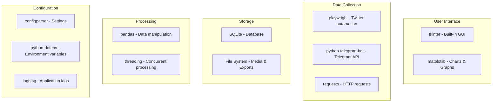

# Technology Stack

## Simple Technology Stack for Prototype

The Anti-India Campaign Detector prototype uses a minimal, straightforward technology stack focused on reliability and ease of deployment.

## Core Technologies



## Technology Details

### User Interface
- **tkinter**: Built-in Python GUI toolkit for desktop application
- **matplotlib**: Simple charts and data visualization

### Data Collection
- **playwright**: Browser automation for Twitter data collection
- **python-telegram-bot**: Official Telegram Bot API wrapper
- **requests**: HTTP client for API calls and fallback operations

### Storage & Data Management
- **SQLite**: Lightweight, serverless database for all data storage
- **pandas**: Data manipulation and analysis
- **File System**: Simple file storage for exports and media

### Configuration & Utilities
- **configparser**: Configuration file management
- **python-dotenv**: Environment variable management for API keys
- **logging**: Application logging and error tracking
- **threading**: Concurrent data collection operations

## Dependencies

### Core Requirements
```bash
pip install pandas>=1.5.0
pip install playwright>=1.40.0
pip install python-telegram-bot>=20.0
pip install requests>=2.31.0
pip install python-dotenv>=1.0.0
pip install matplotlib>=3.7.0
```

### System Requirements
- Python 3.8+
- Windows/Linux/macOS
- 4GB RAM minimum
- 10GB disk space for data storage

## Deployment Architecture

```
Application Structure:
├── main.py              # Main application entry point
├── config/              # Configuration files
├── collectors/          # Data collection modules
│   ├── twitter.py
│   └── telegram.py
├── storage/             # Database and file operations
├── gui/                 # tkinter interface
├── data/                # SQLite database and exports
└── logs/                # Application logs
```

## Technology Benefits

### Simplicity
- Minimal dependencies
- Easy to install and deploy
- No complex infrastructure requirements

### Reliability
- Built-in Python modules where possible
- Well-tested third-party libraries
- Simple error handling and recovery

### Performance
- SQLite for fast local data access
- Threaded operations for concurrent collection
- Efficient data processing with pandas

### Security
- Local data storage (no cloud dependencies)
- Secure API key management
- Simple authentication mechanisms

This simplified technology stack ensures the prototype is easy to understand, deploy, and maintain for research purposes while providing a solid foundation for future enhancements.
