# UML Diagrams

## System Architecture UML Diagrams

This section provides comprehensive UML diagrams that illustrate the structural and behavioral aspects of the Anti-India Campaign Detection System.

## Class Diagrams

### Core System Classes

### Message Processing Classes

### Intelligence Collection Classes

## Activity Diagrams

### Message Processing Workflow

### Intelligence Collection Workflow

## Sequence Diagrams

### Threat Detection Sequence

### Honeypot Operation Sequence

```mermaid
sequenceDiagram
    participant HM as Honeypot Manager
    participant HA as Honeypot Account
    participant TG as Target Group
    participant IE as Intelligence Extractor
    participant OS as OpSec Monitor
    participant DB as Database
    
    HM->>HA: Deploy honeypot account
    HA->>HA: Establish persona
    HA->>TG: Request group access
    TG->>HA: Grant access
    
    loop Intelligence Gathering
        TG->>HA: Group messages
        HA->>IE: Filter high-value content
        IE->>IE: Assess intelligence value
        
        alt High-Value Intelligence
            IE->>DB: Store intelligence
            IE->>OS: Check operational security
            OS->>OS: Assess exposure risk
            
            alt Risk Acceptable
                OS->>HM: Continue operation
            else Risk Too High
                OS->>HM: Recommend extraction
                HM->>HA: Initiate safe extraction
            end
        else Low-Value Content
            IE->>IE: Discard or archive
        end
        
        HA->>HA: Maintain persona activity
        HA->>TG: Participate in discussions
    end
```

## Component Diagrams

### System Deployment Architecture

## State Diagrams

### System Operational States

### Threat Assessment Lifecycle

These UML diagrams provide a comprehensive view of the system's architecture, behavior, and operational workflows, serving as essential documentation for development, maintenance, and operational teams.
