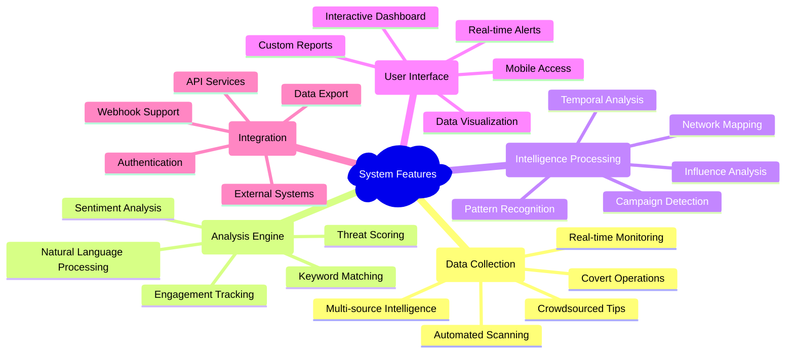
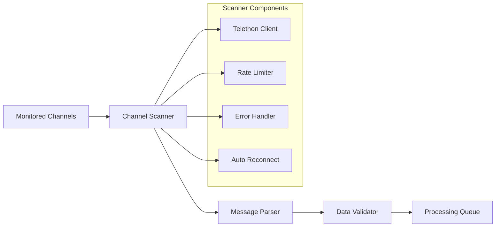
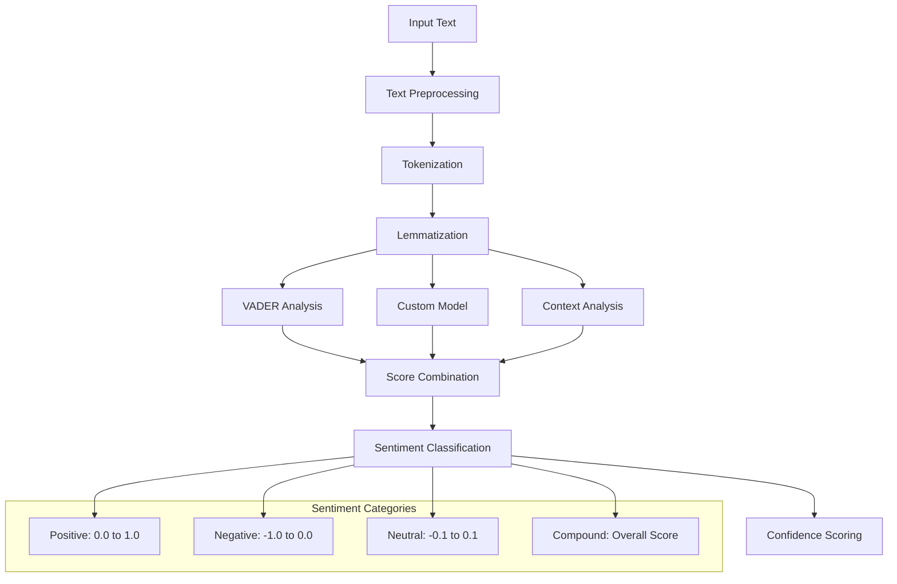
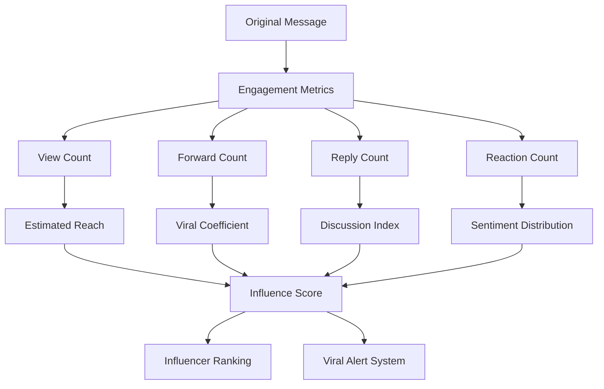
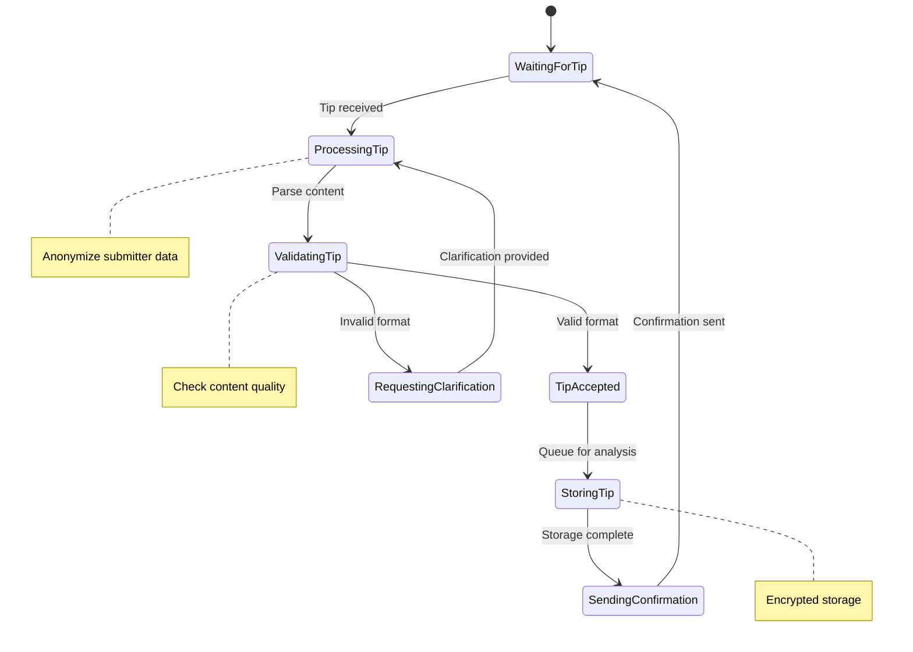
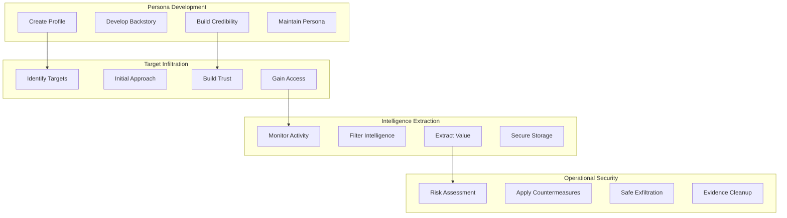
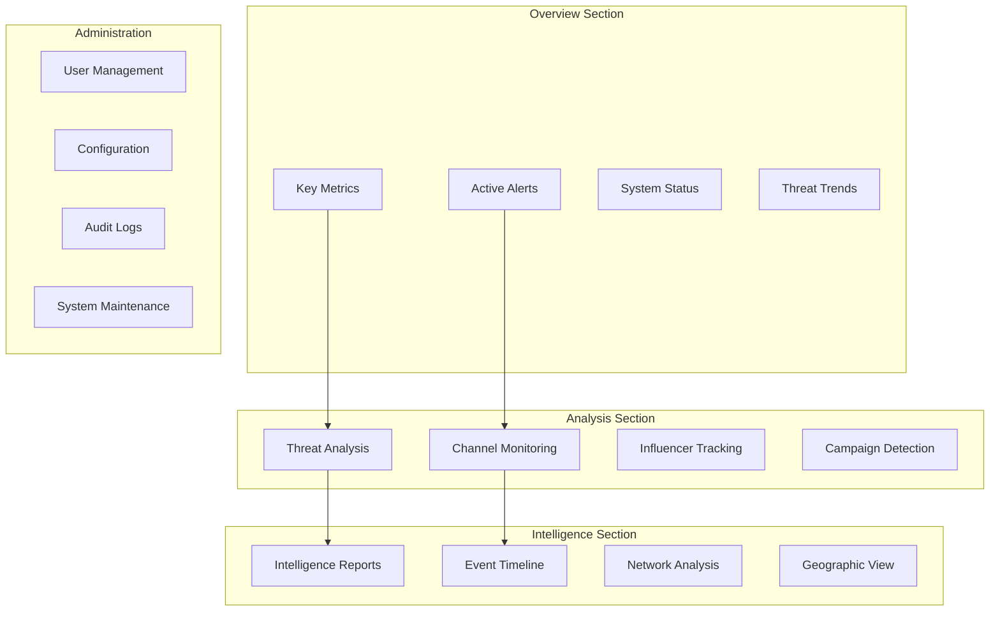
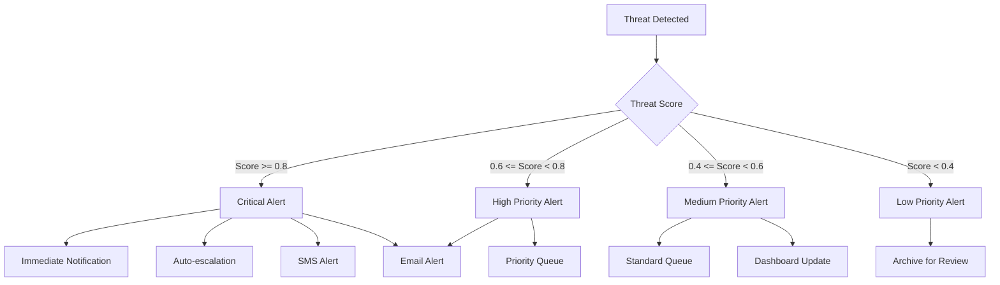

# Feature Overview

## Core System Features

The Anti-India Campaign Detection System provides a comprehensive suite of features designed to address the complex challenges of digital threat detection and intelligence analysis. Each feature is built with security, scalability, and operational effectiveness as primary considerations.

## Feature Architecture

## Primary Features

### 1. Real-Time Public Channel Monitoring

**Objective**: Continuously monitor public Telegram channels for suspicious content and emerging threats.

**Capabilities**:
- **24/7 Automated Scanning**: Continuous monitoring of 500+ public channels
- **Message Parsing**: Real-time extraction and analysis of text content
- **Metadata Collection**: Comprehensive capture of message metadata and engagement metrics
- **Rate Limit Management**: Intelligent API usage to avoid service restrictions
- **Connection Recovery**: Automatic reconnection and error handling

**Technical Implementation**:

**Key Metrics**:
- **Coverage**: 500+ channels monitoring capability
- **Latency**: <5 minutes from message post to system ingestion
- **Reliability**: 99.5% uptime with automatic failover
- **Throughput**: 50,000+ messages per day processing capacity

### 2. Dynamic Keyword Database Management

**Objective**: Maintain and utilize an adaptive keyword database for threat detection and content filtering.

**Features**:
- **Contextual Keyword Matching**: Beyond simple string matching to contextual understanding
- **Multi-language Support**: Keywords in Hindi, English, and regional languages
- **Regular Expression Patterns**: Complex pattern matching for sophisticated threats
- **Dynamic Updates**: Real-time keyword database updates without system restart
- **Categorical Organization**: Keywords organized by threat type and severity

**Keyword Categories**:

| Category | Examples | Weight |
|----------|----------|--------|
| **Violence Indicators** | "आतंक", "हमला", "बम", "attack", "bomb" | 0.9 |
| **Anti-Government** | "सरकार विरोधी", "भ्रष्ट", "corrupt", "regime" | 0.7 |
| **Religious Tension** | "धर्मयुद्ध", "जिहाद", "communal", "riot" | 0.8 |
| **Separatist Content** | "अलगाववाद", "स्वतंत्रता", "independence", "freedom" | 0.6 |
| **Foreign Influence** | "चीन", "पाकिस्तान", "ISI", "propaganda" | 0.7 |

### 3. Advanced Sentiment Analysis Engine

**Objective**: Analyze emotional tone and intent to prioritize hostile content and reduce false positives.

**Advanced Capabilities**:
- **Emotion Detection**: Beyond sentiment to specific emotions (anger, fear, disgust)
- **Cultural Context**: Understanding of Indian cultural and linguistic nuances
- **Sarcasm Detection**: Identification of sarcastic and ironic content
- **Intensity Measurement**: Quantification of emotional intensity levels
- **Multi-language Analysis**: Sentiment analysis across different Indian languages

### 4. Influence and Engagement Tracking

**Objective**: Identify key influencers and viral content by analyzing message reach and engagement patterns.

**Tracking Metrics**:

**Influence Calculation Algorithm**:
$$InfluenceScore = \sum_{i=1}^{n} w_i \times \frac{metric_i}{max(metric_i)} \times time_{decay}$$

Where:
- $w_i$ = Weight for metric $i$
- $metric_i$ = Raw engagement metric
- $time_{decay}$ = Temporal decay factor

### 5. Interactive Tipline Bot

**Objective**: Enable crowdsourced intelligence collection through a user-friendly anonymous reporting system.

**Bot Capabilities**:

**Security Features**:
- **Anonymous Submissions**: No personal data collection or storage
- **Encrypted Storage**: End-to-end encryption for sensitive tips
- **Content Validation**: Automated spam and malicious content detection
- **Priority Classification**: Automatic urgency assessment for tips
- **Feedback System**: Status updates for high-quality submissions

### 6. Honeypot Intelligence Operations

**Objective**: Gather high-value intelligence from private groups through covert operations.

**Operational Framework**:

**Risk Management**:
- **Operational Security**: Strict protocols to prevent detection and compromise
- **Legal Compliance**: Operations within legal frameworks and oversight
- **Evidence Integrity**: Maintaining chain of custody for intelligence
- **Safe Extraction**: Protocols for safe operation termination
- **Cover Maintenance**: Continuous persona credibility management

### 7. Unified Visualization Dashboard

**Objective**: Provide analysts with a comprehensive, real-time view of threats and system status.

**Dashboard Components**:

**Visualization Types**:
- **Time Series Charts**: Threat trends and temporal analysis
- **Heat Maps**: Geographic distribution of threats
- **Network Diagrams**: Relationship mapping between actors
- **Sentiment Gauges**: Real-time sentiment monitoring
- **Alert Dashboards**: Critical threat notifications

### 8. Automated Alerting System

**Objective**: Provide real-time notifications for high-priority threats requiring immediate attention.

**Alert Hierarchy**:

**Notification Channels**:
- **Real-time Dashboard Updates**: Instant visual notifications
- **Email Alerts**: Detailed threat summaries via email
- **SMS Notifications**: Critical alert text messages
- **Mobile Push Notifications**: Mobile app alerts
- **Webhook Integration**: Third-party system notifications

## Secondary Features

### 9. Multi-format Report Generation

**Capabilities**:
- **Executive Summaries**: High-level threat overviews for leadership
- **Technical Reports**: Detailed analysis for security professionals
- **Trend Analysis**: Historical pattern identification and forecasting
- **Custom Reports**: User-defined report parameters and formats
- **Automated Scheduling**: Regular report generation and distribution

### 10. API Integration Framework

**Features**:
- **RESTful API**: Standard HTTP API for external integrations
- **Real-time WebSockets**: Live data streaming capabilities
- **Webhook Support**: Event-driven notifications to external systems
- **Authentication**: Secure API access with JWT tokens
- **Rate Limiting**: API usage quotas and throttling

### 11. Advanced Search and Filtering

**Search Capabilities**:
- **Full-text Search**: Comprehensive message content searching
- **Metadata Filtering**: Filter by channel, date, threat level, etc.
- **Semantic Search**: Context-aware search using NLP
- **Boolean Queries**: Complex search expressions
- **Saved Searches**: Persistent search queries for regular use

### 12. Data Export and Integration

**Export Formats**:
- **CSV/Excel**: Structured data export for analysis
- **JSON**: Programmatic data access and integration
- **PDF Reports**: Formatted documents for presentation
- **Intelligence Feeds**: Standardized threat intelligence formats
- **Database Backups**: Complete system data backups

These features work together to provide a comprehensive threat detection and analysis platform that meets the demanding requirements of national security operations while maintaining usability, reliability, and security.
