# Feature Overview

## Core System Features

The Anti-India Campaign Detection System provides a comprehensive suite of features designed to address the complex challenges of digital threat detection and intelligence analysis. Each feature is built with security, scalability, and operational effectiveness as primary considerations.

## Feature Architecture

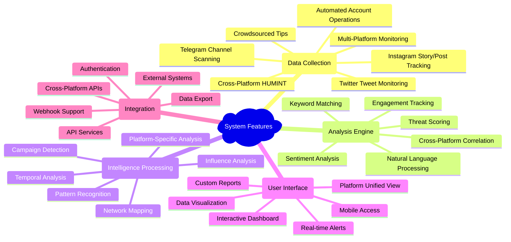

## Primary Features

### 1. Multi-Platform Real-Time Monitoring

**Objective**: Continuously monitor Telegram channels, Instagram stories/posts, and Twitter feeds for suspicious content and emerging threats across all major social media platforms.

**Platform Coverage**:

#### Telegram Monitoring
- **24/7 Channel Scanning**: Continuous monitoring of 500+ public channels
- **Message Parsing**: Real-time extraction and analysis of text content
- **Media Processing**: Image and document analysis capabilities
- **Metadata Collection**: Comprehensive capture of message metadata and engagement metrics

#### Instagram Monitoring  
- **Story Surveillance**: Real-time story viewing and archiving before expiration
- **Feed Post Analysis**: Automated post extraction with image/video analysis
- **IGTV/Reels Tracking**: Comprehensive monitoring of all content formats
- **Private Account Access**: Automated follow requests and approval monitoring
- **Engagement Tracking**: Like, comment, and share pattern analysis

#### Twitter Monitoring
- **Real-time Stream**: Twitter API v2 filtered stream for instant tweet capture
- **User Timeline Tracking**: Individual account monitoring and historical analysis  
- **Hashtag Surveillance**: Trending topic and hashtag campaign detection
- **Thread Analysis**: Complete conversation thread extraction and analysis
- **Space Monitoring**: Twitter Spaces audio content tracking and transcription

**Technical Implementation**:
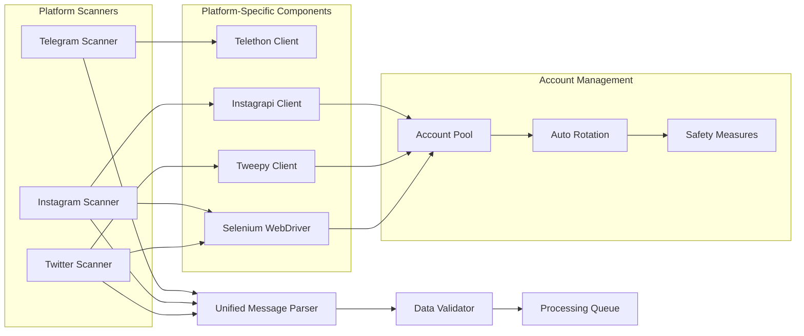

**Cross-Platform Capabilities**:
- **Unified Data Format**: Standardized message structure across all platforms
- **Account Rotation**: Automated account switching to avoid rate limits
- **Human-like Behavior**: Randomized delays and interaction patterns
- **Proxy Integration**: IP rotation for enhanced anonymity
- **Session Persistence**: Long-term authenticated sessions

**Key Metrics**:
- **Platform Coverage**: Telegram (500+ channels), Instagram (1000+ accounts), Twitter (2000+ accounts)
- **Latency**: <5 minutes from content post to system ingestion across all platforms
- **Reliability**: 99.5% uptime with automatic failover and account rotation
- **Throughput**: 100,000+ messages per day processing capacity across platforms

### 2. Dynamic Keyword Database Management

**Objective**: Maintain and utilize an adaptive keyword database for threat detection and content filtering.

**Features**:
- **Contextual Keyword Matching**: Beyond simple string matching to contextual understanding
- **Multi-language Support**: Keywords in Hindi, English, and regional languages
- **Regular Expression Patterns**: Complex pattern matching for sophisticated threats
- **Dynamic Updates**: Real-time keyword database updates without system restart
- **Categorical Organization**: Keywords organized by threat type and severity

**Keyword Categories**:

| Category | Examples | Weight |
|----------|----------|--------|
| **Violence Indicators** | "आतंक", "हमला", "बम", "attack", "bomb" | 0.9 |
| **Anti-Government** | "सरकार विरोधी", "भ्रष्ट", "corrupt", "regime" | 0.7 |
| **Religious Tension** | "धर्मयुद्ध", "जिहाद", "communal", "riot" | 0.8 |
| **Separatist Content** | "अलगाववाद", "स्वतंत्रता", "independence", "freedom" | 0.6 |
| **Foreign Influence** | "चीन", "पाकिस्तान", "ISI", "propaganda" | 0.7 |

### 3. Advanced Sentiment Analysis Engine

**Objective**: Analyze emotional tone and intent to prioritize hostile content and reduce false positives.

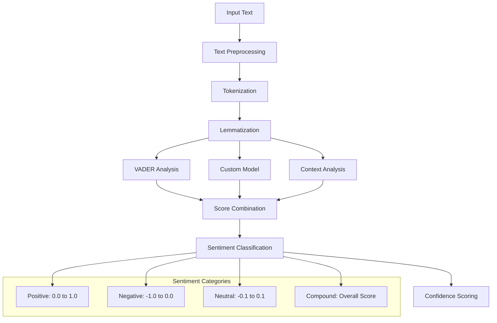

**Advanced Capabilities**:
- **Emotion Detection**: Beyond sentiment to specific emotions (anger, fear, disgust)
- **Cultural Context**: Understanding of Indian cultural and linguistic nuances
- **Sarcasm Detection**: Identification of sarcastic and ironic content
- **Intensity Measurement**: Quantification of emotional intensity levels
- **Multi-language Analysis**: Sentiment analysis across different Indian languages

### 4. Influence and Engagement Tracking

**Objective**: Identify key influencers and viral content by analyzing message reach and engagement patterns.

**Tracking Metrics**:
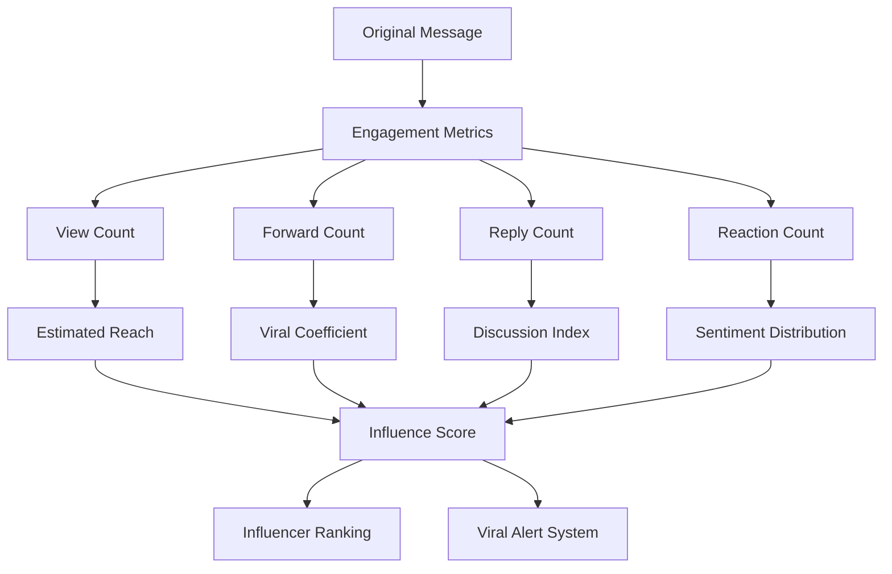

**Influence Calculation Algorithm**:
$$InfluenceScore = \sum_{i=1}^{n} w_i \times \frac{metric_i}{max(metric_i)} \times time_{decay}$$

Where:
- $w_i$ = Weight for metric $i$
- $metric_i$ = Raw engagement metric
- $time_{decay}$ = Temporal decay factor

### 5. Interactive Tipline Bot

**Objective**: Enable crowdsourced intelligence collection through a user-friendly anonymous reporting system.

**Bot Capabilities**:
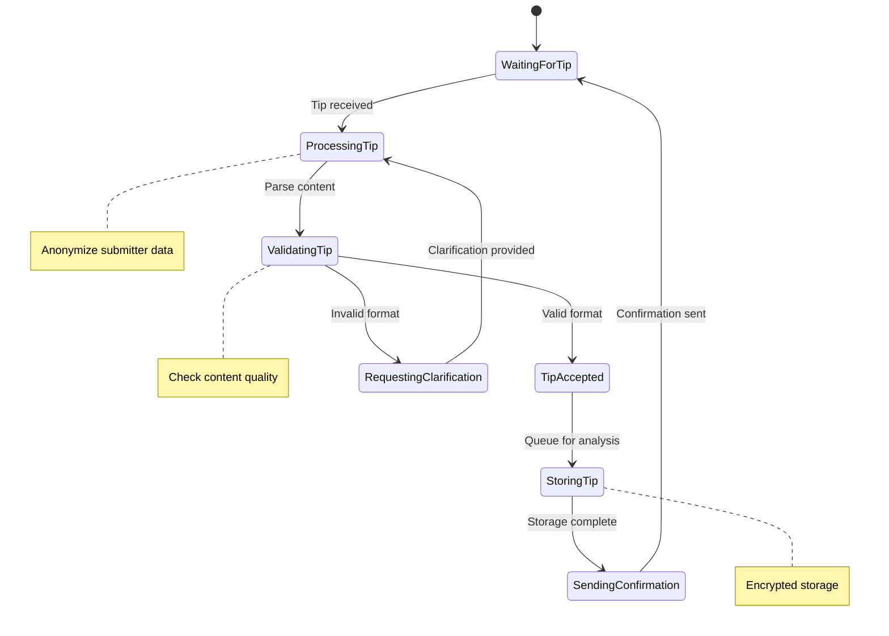

**Security Features**:
- **Anonymous Submissions**: No personal data collection or storage
- **Encrypted Storage**: End-to-end encryption for sensitive tips
- **Content Validation**: Automated spam and malicious content detection
- **Priority Classification**: Automatic urgency assessment for tips
- **Feedback System**: Status updates for high-quality submissions

### 6. Instagram Story & Content Intelligence

**Objective**: Leverage Instagram's ephemeral and visual content for real-time threat detection and influence tracking.

**Automated Capabilities**:
```mermaid
graph TB
    ACCOUNT_POOL[Instagram Account Pool] --> STORY_MONITOR[Story Monitor]
    ACCOUNT_POOL --> POST_TRACKER[Post Tracker]
    ACCOUNT_POOL --> ENGAGEMENT_BOT[Engagement Bot]
    
    STORY_MONITOR --> STORY_ARCHIVE[Story Archive]
    STORY_MONITOR --> OCR_ANALYSIS[OCR Text Analysis]
    STORY_MONITOR --> MEDIA_ANALYSIS[Media Content Analysis]
    
    POST_TRACKER --> POST_METADATA[Post Metadata]
    POST_TRACKER --> HASHTAG_TRACKER[Hashtag Tracking]
    POST_TRACKER --> LOCATION_INTEL[Location Intelligence]
    
    ENGAGEMENT_BOT --> STRATEGIC_LIKES[Strategic Likes]
    ENGAGEMENT_BOT --> FOLLOW_REQUESTS[Follow Requests]
    ENGAGEMENT_BOT --> COMMENT_ANALYSIS[Comment Monitoring]
    
    subgraph "Safety Measures"
        HUMAN_BEHAVIOR[Human-like Behavior]
        PROXY_ROTATION[Proxy Rotation]
        RATE_LIMITING[Smart Rate Limiting]
        CHALLENGE_HANDLING[Challenge Resolution]
    end
    
    STORY_MONITOR --> HUMAN_BEHAVIOR
    POST_TRACKER --> PROXY_ROTATION
    ENGAGEMENT_BOT --> RATE_LIMITING
    ACCOUNT_POOL --> CHALLENGE_HANDLING
```

**Intelligence Collection**:
- **Story Intelligence**: 24-hour story monitoring with automatic archiving
- **Visual Content Analysis**: OCR and image recognition for text in images
- **Hashtag Campaign Tracking**: Monitoring of trending anti-India hashtags
- **Location-Based Intelligence**: Geospatial analysis of threat origins
- **Influence Network Mapping**: Follower/following relationship analysis

**Automation Features**:
- **Strategic Engagement**: Automated likes and follows to maintain account credibility
- **Private Account Access**: Automated follow request campaigns for restricted content
- **Comment Intelligence**: Monitoring and analysis of comment threads
- **Direct Message Monitoring**: Automated DM campaigns for HUMINT operations
- **Account Verification**: Automated verification of suspicious accounts

### 7. Twitter Intelligence & Sentiment Tracking

**Objective**: Monitor Twitter's real-time conversation streams for emerging threats and coordinated campaigns.

**Advanced Monitoring**:
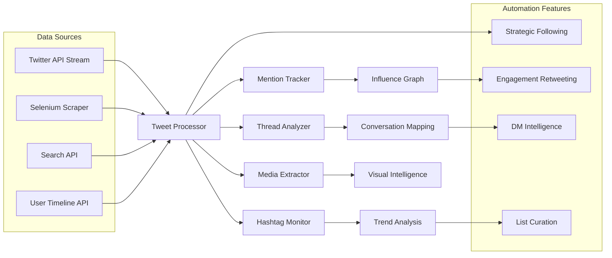

**Real-time Capabilities**:
- **Filtered Stream Monitoring**: Real-time tweet capture based on keywords and accounts
- **Hashtag Campaign Detection**: Automated identification of coordinated hashtag campaigns
- **Bot Network Analysis**: Detection of automated bot networks and coordinated behavior
- **Viral Content Tracking**: Early detection of viral anti-India content
- **Space Intelligence**: Twitter Spaces monitoring and audio transcription

**Behavioral Intelligence**:
- **Coordinated Behavior Detection**: Identification of synchronized posting patterns
- **Influence Operation Mapping**: Network analysis of information operations
- **Engagement Manipulation**: Detection of artificial engagement boosting
- **Account Clustering**: Grouping of related suspicious accounts
- **Temporal Pattern Analysis**: Time-based analysis of coordinated activities

### 8. Cross-Platform Campaign Correlation

**Objective**: Identify coordinated campaigns spanning multiple social media platforms.

**Correlation Engine**:
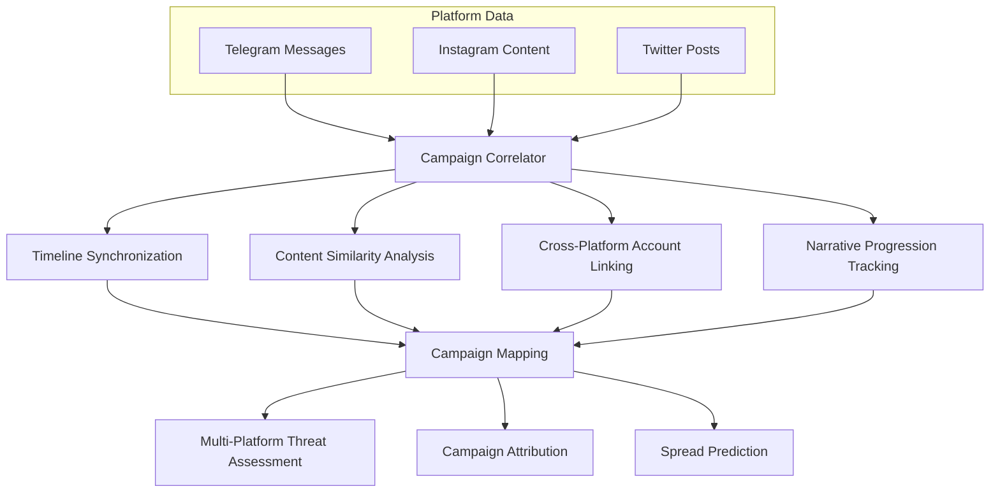

**Advanced Analytics**:
- **Cross-Platform User Identification**: Linking accounts across different platforms
- **Narrative Consistency Tracking**: Following story evolution across platforms
- **Timing Correlation**: Identifying synchronized content release patterns
- **Media Forensics**: Reverse image search across platforms for shared content
- **Influence Cascade Analysis**: Tracking information flow between platforms

### 9. Honeypot Intelligence Operations

**Objective**: Gather high-value intelligence from private groups through covert operations.

**Operational Framework**:
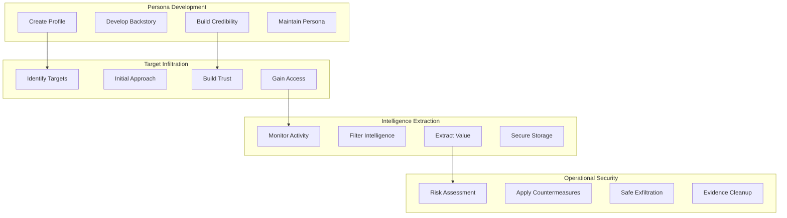

**Risk Management**:
- **Operational Security**: Strict protocols to prevent detection and compromise
- **Legal Compliance**: Operations within legal frameworks and oversight
- **Evidence Integrity**: Maintaining chain of custody for intelligence
- **Safe Extraction**: Protocols for safe operation termination
- **Cover Maintenance**: Continuous persona credibility management

### 10. Unified Visualization Dashboard

**Objective**: Provide analysts with a comprehensive, real-time view of threats and system status.

**Dashboard Components**:
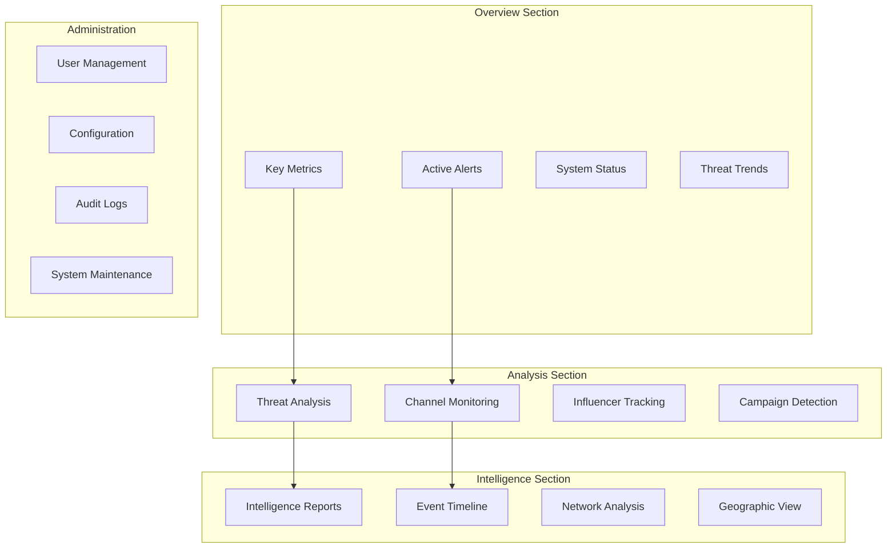

**Visualization Types**:
- **Time Series Charts**: Threat trends and temporal analysis
- **Heat Maps**: Geographic distribution of threats
- **Network Diagrams**: Relationship mapping between actors
- **Sentiment Gauges**: Real-time sentiment monitoring
- **Alert Dashboards**: Critical threat notifications

### 11. Automated Alerting System

**Objective**: Provide real-time notifications for high-priority threats requiring immediate attention.

**Alert Hierarchy**:
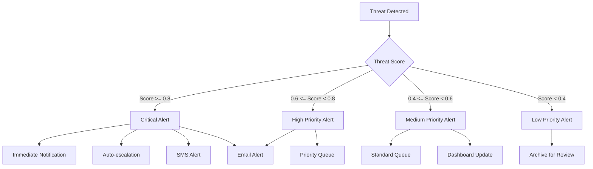

**Notification Channels**:
- **Real-time Dashboard Updates**: Instant visual notifications
- **Email Alerts**: Detailed threat summaries via email
- **SMS Notifications**: Critical alert text messages
- **Mobile Push Notifications**: Mobile app alerts
- **Webhook Integration**: Third-party system notifications

## Secondary Features

### 12. Multi-format Report Generation

**Capabilities**:
- **Executive Summaries**: High-level threat overviews for leadership
- **Technical Reports**: Detailed analysis for security professionals
- **Trend Analysis**: Historical pattern identification and forecasting
- **Custom Reports**: User-defined report parameters and formats
- **Automated Scheduling**: Regular report generation and distribution

### 13. API Integration Framework

**Features**:
- **RESTful API**: Standard HTTP API for external integrations
- **Real-time WebSockets**: Live data streaming capabilities
- **Webhook Support**: Event-driven notifications to external systems
- **Authentication**: Secure API access with JWT tokens
- **Rate Limiting**: API usage quotas and throttling

### 14. Advanced Search and Filtering

**Search Capabilities**:
- **Full-text Search**: Comprehensive message content searching
- **Metadata Filtering**: Filter by channel, date, threat level, etc.
- **Semantic Search**: Context-aware search using NLP
- **Boolean Queries**: Complex search expressions
- **Saved Searches**: Persistent search queries for regular use

### 15. Data Export and Integration

**Export Formats**:
- **CSV/Excel**: Structured data export for analysis
- **JSON**: Programmatic data access and integration
- **PDF Reports**: Formatted documents for presentation
- **Intelligence Feeds**: Standardized threat intelligence formats
- **Database Backups**: Complete system data backups

These features work together to provide a comprehensive threat detection and analysis platform that meets the demanding requirements of national security operations while maintaining usability, reliability, and security.
