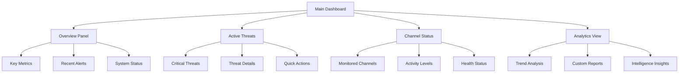

# Quick Start Guide

## Getting Started with AICD

This guide will help you quickly set up and start using the Anti-India Campaign Detection System for threat monitoring and analysis.

## Prerequisites

Before you begin, ensure you have:

- **Python 3.9+** installed on your system
- **Git** for repository management
- **Telegram API credentials** (API ID, API Hash, Bot Token)
- **Administrative privileges** for system setup
- **Stable internet connection** for API access

## Installation Methods

### Method 1: Quick Install (Recommended for New Users)

```bash
# 1. Clone the repository
git clone https://github.com/security-intel/anti-india-campaign-detector.git
cd anti-india-campaign-detector

# 2. Run the quick setup script
chmod +x scripts/quick-setup.sh
./scripts/quick-setup.sh

# 3. Configure your environment
cp .env.example .env
nano .env  # Edit with your API credentials
```

### Method 2: Manual Installation

```bash
# 1. Create and activate virtual environment
python3 -m venv aicd-env
source aicd-env/bin/activate  # Linux/macOS
# aicd-env\Scripts\activate  # Windows

# 2. Install the package
pip install -e ".[dev,docs]"

# 3. Initialize the database
python -c "from src.anti_india_campaign_detector.database import init_db; init_db()"

# 4. Configure environment
cp .env.example .env
# Edit .env with your credentials
```

### Method 3: Docker Installation

```bash
# 1. Using Docker Compose (easiest)
docker-compose up -d

# 2. Access the system
# Dashboard: http://localhost:8501
# API: http://localhost:8000
```

## Initial Configuration

### 1. Telegram API Setup

**Get API Credentials**:
1. Visit [my.telegram.org](https://my.telegram.org)
2. Login with your phone number
3. Create a new application
4. Note your `api_id` and `api_hash`

**Create a Bot**:
1. Message [@BotFather](https://t.me/botfather)
2. Use `/newbot` command
3. Follow instructions
4. Save the bot token

### 2. Environment Configuration

Edit your `.env` file:

```bash
# Required Telegram Settings
TELEGRAM_API_ID=your_api_id_here
TELEGRAM_API_HASH=your_api_hash_here
TELEGRAM_BOT_TOKEN=your_bot_token_here

# Database Settings
DATABASE_URL=sqlite:///./data/aicd.db
REDIS_URL=redis://localhost:6379/0

# Security Settings
SECRET_KEY=generate-a-secure-random-key
JWT_SECRET_KEY=generate-another-secure-key

# Operational Settings
LOG_LEVEL=INFO
MAX_CHANNELS=100
PROCESSING_WORKERS=4
```

### 3. Initial System Test

```bash
# Test system components
python -m anti_india_campaign_detector.tests.system_check

# Expected output:
# ✅ Database connection: OK
# ✅ Redis connection: OK
# ✅ Telegram API: OK
# ✅ NLP models: OK
# ✅ System ready for operation
```

## First-Time Usage

### 1. Start the System

#### Option A: All-in-One Command

```bash
# Start all services with one command
aicd start --all

# This starts:
# - API server (port 8000)
# - Dashboard (port 8501)
# - Background workers
# - Scanner services
```

#### Option B: Individual Services

```bash
# Terminal 1: Start API server
aicd api --host 0.0.0.0 --port 8000

# Terminal 2: Start dashboard
aicd dashboard --port 8501

# Terminal 3: Start workers
aicd workers --concurrency 4

# Terminal 4: Start scanner
aicd scanner --config config/default.yaml
```

### 2. Access the Dashboard

1. Open your browser to `http://localhost:8501`
2. Log in with default credentials:
   - **Username**: `admin`
   - **Password**: `aicd2024!` (change immediately)
3. Complete the initial setup wizard

### 3. Add Your First Channels

```python
# Python script to add channels
from anti_india_campaign_detector.channel_manager import ChannelManager

manager = ChannelManager()

# Add some sample channels (replace with real channels)
channels = [
    "@news_channel_example",
    "@public_discussion_group",
    "@community_channel"
]

for channel in channels:
    result = manager.add_channel(
        channel_id=channel,
        risk_level="medium",
        monitoring_active=True
    )
    print(f"Added {channel}: {result.status}")
```

## Basic Operations

### Channel Management

```bash
# List all monitored channels
aicd channels list

# Add a new channel
aicd channels add "@channel_username" --risk-level high

# Remove a channel
aicd channels remove "@channel_username"

# Update channel settings
aicd channels update "@channel_username" --risk-level medium
```

### Viewing Threats

```bash
# View recent threats
aicd threats list --limit 10

# View high-priority threats
aicd threats list --level critical --level high

# Export threat report
aicd threats export --format pdf --output report.pdf
```

### System Monitoring

```bash
# Check system status
aicd status

# View real-time logs
aicd logs --follow

# View system metrics
aicd metrics --dashboard
```

## Dashboard Walkthrough

### Main Dashboard Overview



### Key Dashboard Features

1. **Real-time Threat Feed**:
   - Live updates of detected threats
   - Color-coded threat levels
   - Quick action buttons

2. **Channel Monitoring Status**:
   - Health status of all monitored channels
   - Message processing statistics
   - Connection status indicators

3. **Analytics and Reports**:
   - Trend analysis over time
   - Channel activity comparisons
   - Threat pattern identification

4. **Alert Management**:
   - Active alert notifications
   - Alert acknowledgment system
   - Escalation procedures

## Common Tasks

### Adding New Keywords

```python
# Using Python API
from anti_india_campaign_detector.keywords import KeywordManager

km = KeywordManager()

# Add individual keywords
km.add_keyword("terrorist", category="violence", weight=0.9)
km.add_keyword("attack", category="violence", weight=0.8)

# Add keyword lists
violence_keywords = ["bomb", "explosion", "militant", "extremist"]
km.add_keywords(violence_keywords, category="violence")

# Update keyword database
km.save_changes()
```

### Configuring Alerts

```yaml
# alerts.yaml
alert_rules:
  critical:
    threat_score: ">= 0.8"
    keywords: ["terrorist", "bomb", "attack"]
    channels: ["high_risk_channels"]
    notifications:
      - email: "security@agency.gov"
      - sms: "+1234567890"
      - dashboard: true
      
  high:
    threat_score: ">= 0.6"
    sentiment: "< -0.7"
    engagement: "> 1000"
    notifications:
      - email: "analysts@agency.gov"
      - dashboard: true
```

### Generating Reports

```bash
# Daily threat summary
aicd report daily --email security@agency.gov

# Weekly intelligence briefing
aicd report weekly --format pdf --detailed

# Custom date range report
aicd report custom \
  --start "2024-01-01" \
  --end "2024-01-31" \
  --channels "@high_risk_channel" \
  --format excel
```

## Troubleshooting Quick Fixes

### Common Issues

#### 1. "Cannot connect to Telegram"

```bash
# Check network connectivity
ping api.telegram.org

# Verify credentials
aicd test telegram-connection

# Reset Telegram session
rm sessions/*.session
aicd scanner --reset-session
```

#### 2. "Database connection failed"

```bash
# Check database file permissions
ls -la data/aicd.db

# Reinitialize database if corrupted
aicd database reset --confirm

# Create missing directories
mkdir -p data logs
```

#### 3. "Dashboard not loading"

```bash
# Check if port is available
lsof -i :8501

# Restart dashboard service
aicd dashboard restart

# Clear browser cache and refresh
```

#### 4. "High memory usage"

```bash
# Check system resources
aicd system resources

# Reduce processing workers
aicd config set PROCESSING_WORKERS 2

# Enable batch processing mode
aicd config set BATCH_MODE true
```

## Performance Optimization Tips

### For Small Deployments (< 50 channels)

```yaml
# config/small.yaml
system:
  workers: 2
  batch_size: 50
  cache_ttl: 3600
  
processing:
  concurrent_channels: 10
  message_queue_size: 1000
  
monitoring:
  update_interval: 60
  metrics_retention: "7d"
```

### For Large Deployments (> 200 channels)

```yaml
# config/large.yaml
system:
  workers: 8
  batch_size: 500
  cache_ttl: 7200
  
processing:
  concurrent_channels: 50
  message_queue_size: 10000
  
monitoring:
  update_interval: 30
  metrics_retention: "30d"
```

## Security Best Practices

### Initial Security Setup

```bash
# Change default passwords
aicd user change-password admin

# Create operational users
aicd user create analyst --role analyst
aicd user create operator --role operator

# Enable two-factor authentication
aicd security enable-2fa

# Configure API key rotation
aicd security api-key rotate --schedule weekly
```

### Network Security

```bash
# Configure firewall rules
sudo ufw allow 8000/tcp  # API
sudo ufw allow 8501/tcp  # Dashboard
sudo ufw deny 6379/tcp   # Redis (internal only)

# Enable SSL/TLS
aicd security enable-ssl --cert /path/to/cert.pem --key /path/to/key.pem
```

## Getting Help

### Documentation Resources

- **Full Documentation**: [https://docs.aicd.security.gov](https://docs.aicd.security.gov)
- **API Reference**: [https://api.aicd.security.gov/docs](https://api.aicd.security.gov/docs)
- **Video Tutorials**: [https://training.aicd.security.gov](https://training.aicd.security.gov)

### Support Channels

- **Technical Support**: [support@aicd.security.gov](mailto:support@aicd.security.gov)
- **Security Issues**: [security@aicd.security.gov](mailto:security@aicd.security.gov)
- **Feature Requests**: [GitHub Issues](https://github.com/security-intel/anti-india-campaign-detector/issues)

### Command-Line Help

```bash
# General help
aicd --help

# Command-specific help
aicd channels --help
aicd threats --help
aicd dashboard --help

# Configuration help
aicd config --help
```

## Next Steps

Once you have the system running:

1. **Configure your specific threat keywords** relevant to your area of responsibility
2. **Set up automated reporting** for regular intelligence briefings
3. **Integrate with existing security tools** using the API
4. **Train your team** on dashboard usage and threat analysis
5. **Establish operational procedures** for threat response

You're now ready to start monitoring digital threats with the Anti-India Campaign Detection System!
