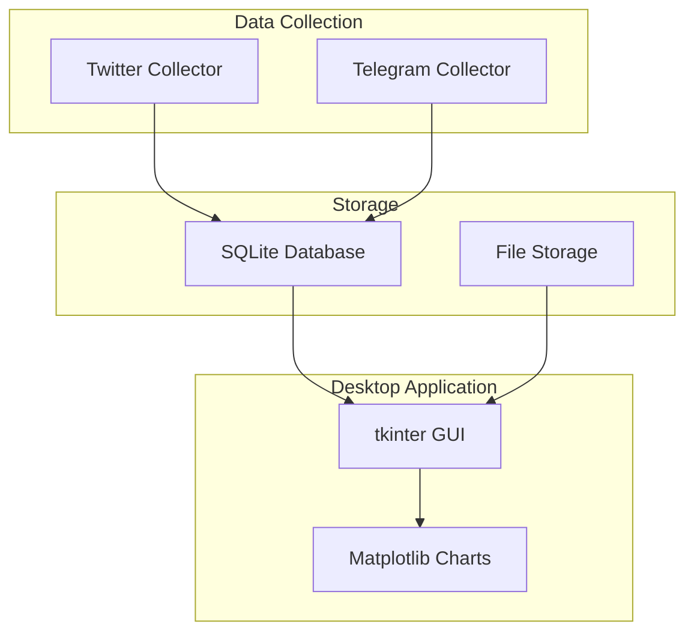

# Anti-India Campaign Detector - Research Prototype

## Overview

The **Anti-India Campaign Detector** is a simple research prototype designed to collect and analyze social media data for detecting potential coordinated disinformation campaigns. This system focuses on basic data collection and storage using a straightforward desktop application.

## 🚀 Key Features

- **Simple Data Collection**: Basic collection from Twitter and Telegram platforms
- **Desktop Application**: tkinter-based GUI for easy operation
- **SQLite Storage**: Simple database for storing collected data  
- **Basic Processing**: Message cleaning and organization
- **Data Export**: Export collected data in CSV/JSON formats
- **Research Focus**: Designed for academic and research purposes

## 🎯 Project Purpose

To provide researchers with a simple tool for collecting social media data to study disinformation patterns and campaign coordination tactics in a controlled, ethical research environment.

## 📊 System Architecture



## 🏗️ Simple Architecture

The prototype follows a straightforward architecture:

1. **Data Collection**: Twitter and Telegram collectors
2. **Storage**: SQLite database for all data
3. **Processing**: Basic message cleaning and organization
4. **Interface**: tkinter desktop application

## 🛠️ Technology Stack

| Component | Technology | Purpose |
|-----------|------------|---------|
| **Core Language** | Python 3.8+ | System development |
| **Twitter Collection** | playwright | Browser automation |
| **Telegram Integration** | python-telegram-bot | Bot API integration |
| **Database** | SQLite | Data storage |
| **GUI Framework** | tkinter | Desktop interface |
| **Visualization** | matplotlib | Basic charts |
| **Data Processing** | pandas | Data manipulation |

## 📋 Quick Start

1. **Install Dependencies**
   ```bash
   pip install playwright python-telegram-bot pandas matplotlib
   ```

2. **Configure Settings**
   - Add your API keys to the configuration
   - Set up collection parameters

3. **Launch Application**
   ```bash
   python main.py
   ```

4. **Start Collecting**
   - Configure data sources in the GUI
   - Start collection processes
   - Monitor progress and export data

## 📊 Current Capabilities

- Basic Twitter data collection via browser automation
- Telegram channel/group message monitoring
- Simple data storage and organization
- Basic data visualization and export
- Desktop GUI for easy operation

## � Research Applications

- Academic study of social media campaigns
- Analysis of coordination patterns
- Development of detection algorithms
- Training data generation for ML models
- Educational purposes and demonstrations

## 📈 Future Development

See [Vision Document](vision.md) for planned enhancements including advanced NLP, real-time analysis, and expanded platform support.

## 🔒 Ethical Guidelines

- Research and educational use only
- Respect platform terms of service
- Data privacy and anonymization
- No surveillance of individuals
- Academic and research transparency

## � Documentation Structure

- **[Project Overview](project-overview/overview.md)**: Project scope and objectives
- **[Architecture](architecture/overview.md)**: Simple system architecture
- **[Features](features/overview.md)**: Current capabilities
- **[Development](development/setup.md)**: Setup and development guide
- **[Vision](vision.md)**: Future enhancements and features

## 🚀 Getting Started

1. Read the [Quick Start Guide](guides/quickstart.md)
2. Review the [Project Versions](project-overview/versions.md) 
3. Set up your [Development Environment](development/setup.md)
4. Explore the [Architecture Overview](architecture/overview.md)
- **Account Safety**: Implements human-like behavior patterns to avoid detection
- **Data Protection**: Secure handling of sensitive intelligence data

## 📞 Support & Contact

- **Documentation**: [Project Documentation](https://security-intel.github.io/anti-india-campaign-detector/)
- **Issues**: [GitHub Issues](https://github.com/security-intel/anti-india-campaign-detector/issues)
- **Contact**: [team@security.gov](mailto:team@security.gov)

---

!!! warning "Important Notice"
    This system is designed for use by authorized security agencies and law enforcement personnel. Ensure compliance with all applicable laws and regulations in your jurisdiction before deployment.
