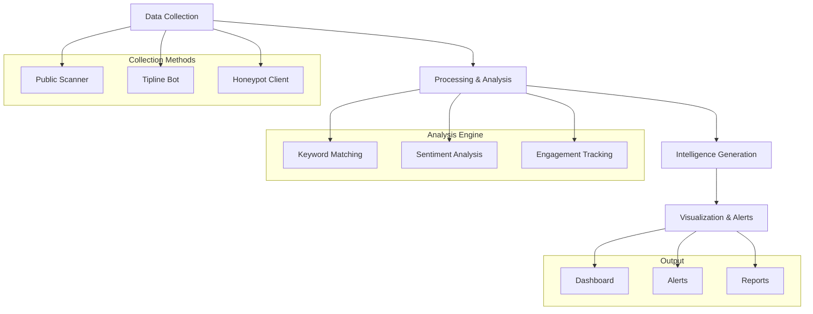

# Anti-India Campaign Detection System

{ width="200" }

## Overview

The **Anti-India Campaign Detection System** is a comprehensive intelligence-gathering and analysis platform designed to identify, monitor, and analyze hostile narratives targeting India on digital platforms. This system leverages advanced Natural Language Processing (NLP), multi-layered intelligence strategies, and real-time monitoring to provide actionable intelligence to security agencies.

## 🚀 Key Features

- **Real-time Monitoring**: Continuous surveillance of public Telegram channels
- **Multi-Intelligence Approach**: Combines SIGINT, HUMINT, and OSINT capabilities
- **Advanced NLP**: Sentiment analysis and contextual filtering to reduce false positives
- **Interactive Dashboard**: Streamlit-based visualization for real-time threat assessment
- **Honeypot Integration**: Advanced HUMINT capabilities for accessing private communities
- **Crowdsourced Intelligence**: Public tipline for community-driven intelligence gathering

## 🎯 Mission Statement

To provide security agencies with a robust, intelligent, and adaptable system for early detection and analysis of anti-India campaigns, enabling timely and informed preventive actions against digital threats to national security.

## 📊 System Capabilities



## 🏗️ Architecture Overview

The system follows a modular, layered architecture:

1. **Data Collection Layer**: Multi-source intelligence gathering
2. **Processing Layer**: Advanced NLP and analysis engines  
3. **Storage Layer**: Efficient data management and retrieval
4. **Presentation Layer**: Interactive dashboards and alerting

## 🛠️ Technology Stack

| Component | Technology | Purpose |
|-----------|------------|---------|
| **Core Language** | Python 3.9+ | System development |
| **Telegram Integration** | Telethon | Channel monitoring |
| **NLP Engine** | VADER, spaCy | Sentiment analysis |
| **Web Framework** | FastAPI | API services |
| **Dashboard** | Streamlit | User interface |
| **Database** | SQLite, Redis | Data storage |
| **Task Queue** | Celery | Background processing |

## 🚦 Project Status

- **Phase**: Proof of Concept Development
- **Version**: 0.1.0
- **Target Platform**: Telegram (Initial Focus)
- **Deployment**: Development Environment

## 📖 Quick Navigation

<div class="grid cards" markdown>

-   :material-book-open-variant:{ .lg .middle } __Project Overview__

    ---

    Understand the project's scope, objectives, and key definitions

    [:octicons-arrow-right-24: Learn more](project-overview/overview.md)

-   :material-cog:{ .lg .middle } __System Architecture__

    ---

    Explore the technical architecture, components, and design patterns

    [:octicons-arrow-right-24: Architecture](architecture/overview.md)

-   :material-feature-search:{ .lg .middle } __Core Features__

    ---

    Discover the system's capabilities and intelligence-gathering strategies

    [:octicons-arrow-right-24: Features](features/overview.md)

-   :material-code-tags:{ .lg .middle } __Development__

    ---

    Set up your development environment and start contributing

    [:octicons-arrow-right-24: Get Started](development/setup.md)

</div>

## ⚡ Quick Start

```bash
# Clone the repository
git clone https://github.com/security-intel/anti-india-campaign-detector.git
cd anti-india-campaign-detector

# Install dependencies
pip install -e ".[dev,docs]"

# Start the development server
aicd-dashboard --debug
```

## 🔒 Security & Compliance

This system is designed with security and legal compliance as primary considerations:

- **Privacy First**: No user de-anonymization or IP tracking
- **Legal Compliance**: Focuses only on public data sources
- **Ethical OSINT**: Follows responsible intelligence gathering practices
- **Data Protection**: Secure handling of sensitive intelligence data

## 📞 Support & Contact

- **Documentation**: [Project Documentation](https://security-intel.github.io/anti-india-campaign-detector/)
- **Issues**: [GitHub Issues](https://github.com/security-intel/anti-india-campaign-detector/issues)
- **Contact**: [team@security.gov](mailto:team@security.gov)

---

!!! warning "Important Notice"
    This system is designed for use by authorized security agencies and law enforcement personnel. Ensure compliance with all applicable laws and regulations in your jurisdiction before deployment.
