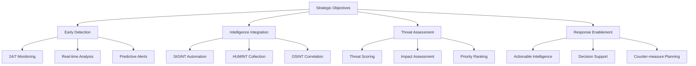
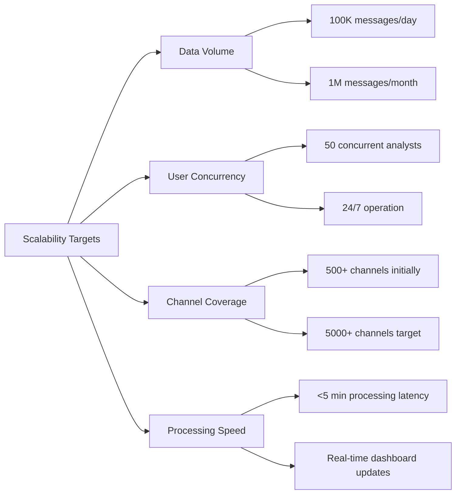
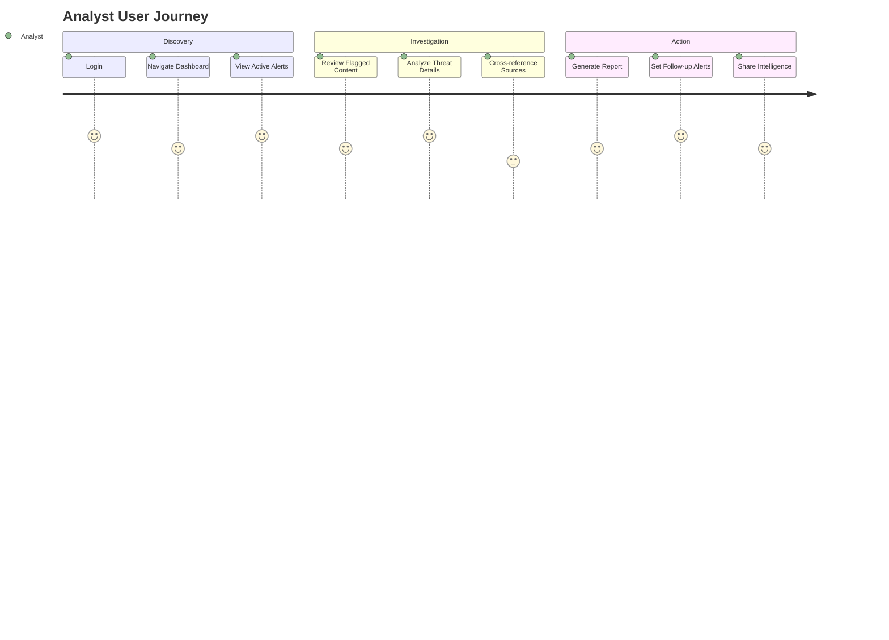
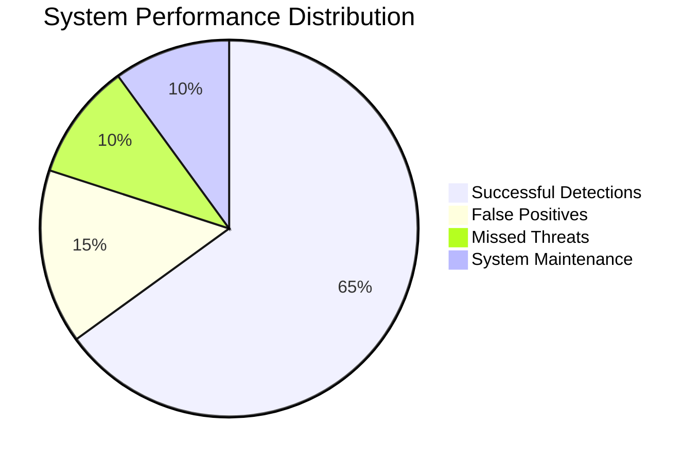

# Project Objectives

## Strategic Objectives

### Primary Mission Objectives

The Anti-India Campaign Detection System is designed to achieve four core strategic objectives that directly support India's national security and digital sovereignty:

#### 1. Early Threat Detection
**Objective**: Identify and flag anti-India propaganda campaigns within 4 hours of initial deployment across monitored channels.

**Key Results**:
- Achieve 85% detection rate for coordinated campaigns
- Maintain <15% false positive rate in threat identification
- Provide alerts within 2 hours of threat threshold breach
- Monitor 500+ active Telegram channels continuously

**Success Metrics**:
- **Detection Latency**: Average time from campaign start to system alert
- **Coverage Breadth**: Number of channels and groups under active monitoring
- **Alert Accuracy**: Ratio of actionable alerts to total notifications generated

#### 2. Multi-Source Intelligence Integration
**Objective**: Combine automated signals intelligence (SIGINT), human intelligence (HUMINT), and open-source intelligence (OSINT) into a unified threat assessment framework.

**Key Results**:
- Integrate 3 distinct intelligence collection methods
- Achieve 90% data correlation accuracy across sources
- Maintain operational security for all HUMINT assets
- Process 10,000+ messages daily across all collection streams

**Success Metrics**:
- **Source Diversity**: Number of active intelligence collection channels
- **Data Fusion Accuracy**: Quality of cross-source correlation and validation
- **HUMINT Security**: Zero compromise incidents for honeypot operations

#### 3. Threat Prioritization and Assessment
**Objective**: Automatically assess threat levels and prioritize analyst attention on the most critical and rapidly spreading campaigns.

**Key Results**:
- Implement 5-tier threat classification system
- Achieve 80% accuracy in threat level assignments
- Reduce analyst workload by 60% through automated filtering
- Identify key influencers and viral content within 1 hour of emergence

**Success Metrics**:
- **Classification Accuracy**: Percentage of correctly assessed threat levels
- **Analyst Efficiency**: Reduction in manual review time for low-priority content
- **Influence Detection**: Speed and accuracy of key influencer identification

#### 4. Response Enablement
**Objective**: Provide security agencies with actionable intelligence and decision support tools for timely intervention and countermeasures.

**Key Results**:
- Deliver comprehensive threat reports within 2 hours of detection
- Provide evidence packages suitable for legal proceedings
- Enable predictive analysis for campaign trajectory forecasting
- Support coordination between multiple security agencies

**Success Metrics**:
- **Response Time**: Time from detection to actionable intelligence delivery
- **Evidence Quality**: Percentage of reports leading to successful interventions
- **Inter-agency Adoption**: Number of agencies actively using system outputs

## Technical Objectives

### System Performance Goals

#### Scalability Requirements

#### Reliability and Availability
| Metric | Target | Measurement |
|--------|--------|-------------|
| **System Uptime** | 99.5% | Monthly availability percentage |
| **Data Recovery Time** | <30 minutes | Maximum downtime for system restoration |
| **False Positive Rate** | <15% | Percentage of incorrect threat classifications |
| **Processing Latency** | <5 minutes | Time from message collection to analysis completion |

### Intelligence Quality Objectives

#### Accuracy Targets
- **Sentiment Analysis**: 85% accuracy in emotional tone classification
- **Keyword Matching**: 95% precision in relevant content identification  
- **Threat Assessment**: 80% accuracy in threat level assignments
- **Campaign Detection**: 90% success rate in identifying coordinated activities

#### Coverage and Completeness
- **Channel Monitoring**: Complete coverage of all designated high-priority channels
- **Message Capture**: 99% capture rate for public messages in monitored channels
- **Metadata Collection**: Full extraction of available message metadata and engagement metrics
- **Historical Analysis**: Complete backlog processing for newly added channels

## Operational Objectives

### User Experience Goals

#### Dashboard Usability

#### Training and Adoption
- **User Onboarding**: Complete analyst training program within 2 days
- **System Proficiency**: 90% of users achieve operational proficiency within 1 week
- **Feature Utilization**: 80% adoption rate for advanced dashboard features
- **User Satisfaction**: Maintain >4.0/5.0 user satisfaction rating

### Integration Objectives

#### System Interoperability
- **API Compatibility**: RESTful API endpoints for external system integration
- **Data Export**: Standardized formats for intelligence sharing with partner agencies
- **Alert Integration**: Webhook support for external notification systems
- **Authentication**: Single sign-on (SSO) integration with existing security infrastructure

#### Workflow Integration
- **Incident Response**: Seamless handoff to incident response teams
- **Evidence Management**: Integration with digital forensics and evidence management systems
- **Reporting Chain**: Automated report generation for supervisory and executive briefings
- **Inter-agency Coordination**: Secure intelligence sharing protocols with partner organizations

## Success Measurement Framework

### Key Performance Indicators (KPIs)

#### Operational Metrics

#### Impact Measurements
1. **Threat Mitigation**: Number of campaigns disrupted or neutralized
2. **Response Acceleration**: Reduction in time from threat emergence to agency action
3. **Intelligence Quality**: Percentage of system reports leading to successful interventions
4. **Cost Effectiveness**: Comparison of manual vs. automated monitoring costs

### Evaluation Criteria

#### Short-term Milestones (3-6 months)
- [ ] Complete core system development and testing
- [ ] Achieve stable monitoring of 100+ Telegram channels
- [ ] Demonstrate 80% accuracy in threat classification
- [ ] Deploy functional web dashboard with basic analytics

#### Medium-term Goals (6-12 months)
- [ ] Scale to 500+ monitored channels
- [ ] Implement advanced NLP and sentiment analysis
- [ ] Achieve <10% false positive rate
- [ ] Deploy honeypot operations for private group intelligence

#### Long-term Vision (12-24 months)
- [ ] Expand to multi-platform monitoring (Twitter, Facebook, etc.)
- [ ] Implement predictive analytics for campaign forecasting
- [ ] Achieve full operational deployment across security agencies
- [ ] Establish continuous improvement and adaptation mechanisms

This comprehensive objectives framework provides clear, measurable targets for the Anti-India Campaign Detection System while ensuring alignment with national security priorities and operational requirements.
