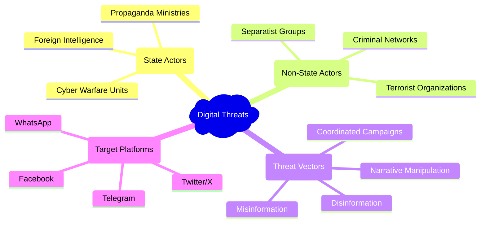
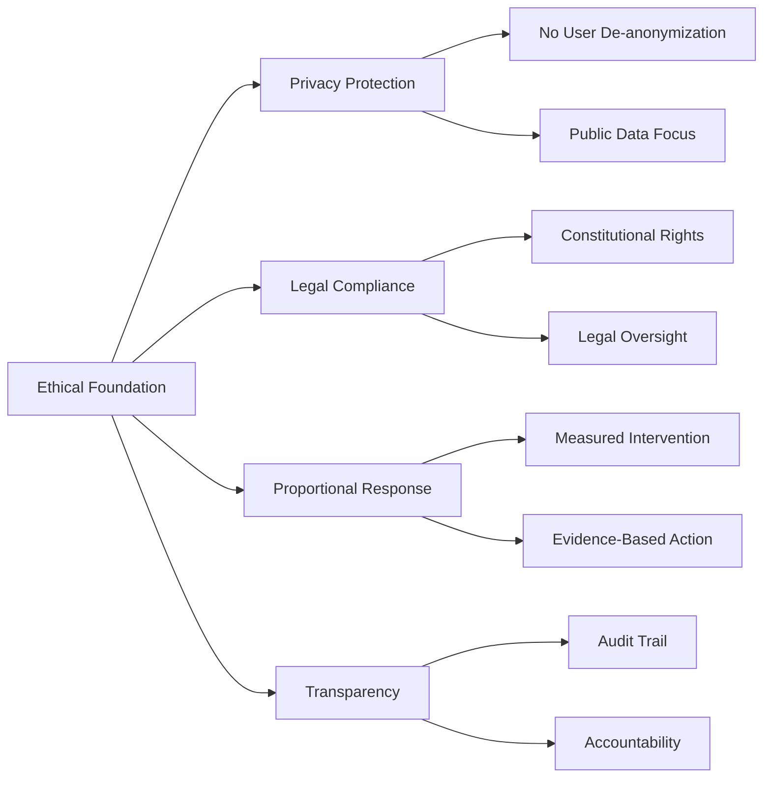
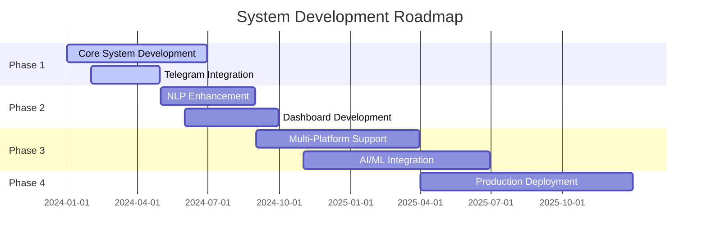

# Project Overview

## Executive Summary

The **Anti-India Campaign Detection System** represents a critical response to the growing threat of digital propaganda and information warfare targeting India's national interests. In an era where social media platforms serve as battlegrounds for narrative control and public opinion manipulation, this system provides security agencies with advanced capabilities to detect, analyze, and counter hostile campaigns before they achieve widespread impact.

## Mission-Critical Objectives

### Primary Mission
To develop and deploy an intelligent monitoring system that identifies anti-India propaganda campaigns across digital platforms, providing security agencies with actionable intelligence for timely intervention and countermeasures.

### Strategic Goals

1. **Early Threat Detection**: Identify emerging hostile narratives before they gain significant traction
2. **Intelligence Integration**: Combine multiple intelligence sources (SIGINT, HUMINT, OSINT) for comprehensive situational awareness
3. **Operational Efficiency**: Reduce manual monitoring workload through automated analysis and prioritization
4. **Adaptive Response**: Continuously evolve detection capabilities to counter adversarial tactics

## The Digital Threat Landscape

### Contemporary Challenges

In today's interconnected world, malicious actors exploit digital platforms to:

- **Destabilize National Unity**: Spread divisive content targeting religious, ethnic, or regional communities
- **Undermine Government Credibility**: Propagate false narratives about policy decisions and governance
- **Incite Social Unrest**: Coordinate messaging to trigger protests, riots, or civil disturbances
- **Foreign Interference**: Enable state-sponsored actors to influence domestic politics and public opinion

## System Philosophy

### Intelligence-Driven Approach

The system operates on the principle that effective counter-intelligence requires:

1. **Comprehensive Coverage**: Monitor both obvious and hidden communication channels
2. **Contextual Understanding**: Distinguish between legitimate criticism and malicious propaganda
3. **Temporal Analysis**: Track narrative evolution and campaign momentum
4. **Network Analysis**: Identify key influencers and coordination patterns

### Ethical Framework

## Strategic Importance

### National Security Impact

The system addresses several critical national security concerns:

- **Information Warfare Defense**: Counter sophisticated disinformation campaigns
- **Social Cohesion Protection**: Prevent narratives designed to fragment society
- **Democratic Process Security**: Safeguard electoral integrity and public discourse
- **Economic Stability**: Protect against rumors that could destabilize markets

### Operational Advantages

1. **Force Multiplication**: Enable small analyst teams to monitor vast digital landscapes
2. **Predictive Capability**: Identify campaign patterns before full deployment
3. **Resource Optimization**: Focus investigative efforts on highest-priority threats
4. **Inter-Agency Coordination**: Provide common intelligence picture for multiple stakeholders

## Success Metrics

### Primary Indicators

| Metric | Target | Measurement Method |
|--------|--------|-------------------|
| **Detection Speed** | < 4 hours | Time from campaign start to system alert |
| **False Positive Rate** | < 15% | Ratio of false alerts to true threats |
| **Coverage Breadth** | 500+ channels | Number of monitored information sources |
| **Response Time** | < 2 hours | Time from alert to analyst review |

### Secondary Indicators

- **Campaign Disruption Rate**: Percentage of detected campaigns neutralized
- **Intelligence Quality**: Accuracy and actionability of generated reports
- **System Uptime**: Operational availability and reliability
- **User Adoption**: Analyst engagement and system utilization

## Future Evolution

### Planned Enhancements

1. **Multi-Platform Expansion**: Extend monitoring to Twitter, Facebook, and other platforms
2. **Advanced Analytics**: Implement machine learning for pattern recognition
3. **Predictive Modeling**: Develop forecasting capabilities for campaign trajectory
4. **Automated Response**: Integration with content reporting and takedown systems

### Technology Roadmap

This comprehensive overview establishes the foundation for understanding the system's critical role in protecting India's digital sovereignty and maintaining social stability in an increasingly connected world.
