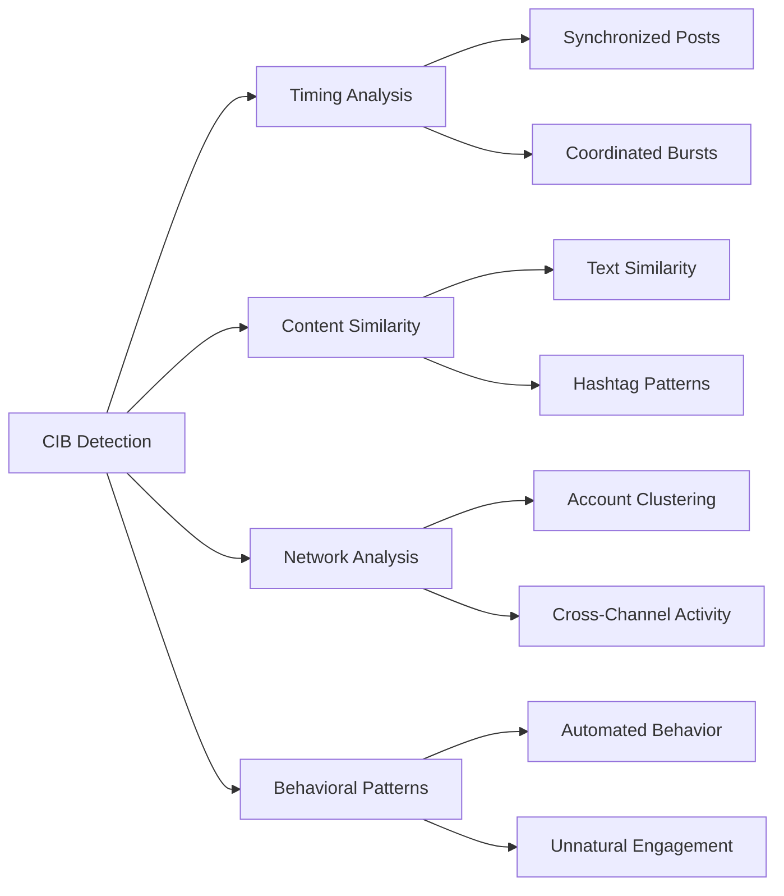
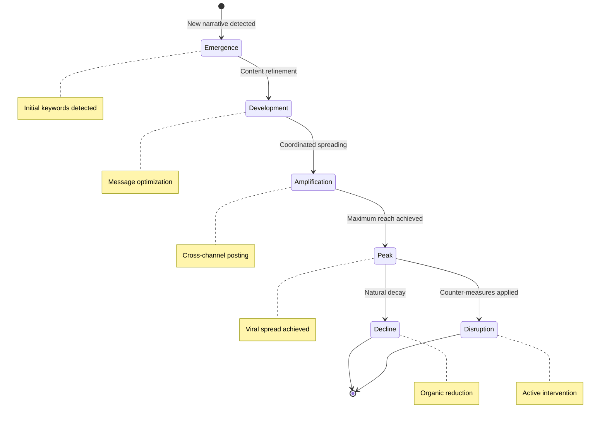

# Scope and Definitions

## Project Scope

### In-Scope Components

```mermaid
graph TD
    A[Project Scope] --> B[Platform Coverage]
    A --> C[Data Collection]
    A --> D[Analysis Capabilities]
    A --> E[Intelligence Sources]
    A --> F[Deliverables]
    
    B --> B1[Telegram Public Channels]
    B --> B2[Telegram Public Groups]
    
    C --> C1[Text Messages]
    C --> C2[Message Metadata]
    C --> C3[User Interactions]
    C --> C4[Forward Counts]
    
    D --> D1[Keyword Detection]
    D --> D2[Sentiment Analysis]
    D --> D3[Engagement Analysis]
    D --> D4[Trend Identification]
    
    E --> E1[Automated SIGINT]
    E --> E2[Public Tipline HUMINT]
    E --> E3[Honeypot HUMINT]
    
    F --> F1[Web Dashboard]
    F --> F2[Alert System]
    F --> F3[Intelligence Reports]
```

#### Platform Focus
- **Primary Target**: Telegram messaging platform
- **Channel Types**: Public channels and groups only
- **Geographic Focus**: India-related content and campaigns
- **Language Support**: Multi-language with primary focus on English and Hindi

#### Data Collection Scope
- **Message Content**: Full text analysis of public messages
- **Metadata Extraction**: Timestamps, channel IDs, user handles (public only)
- **Engagement Metrics**: Forward counts, view counts, reaction data
- **Network Analysis**: Channel-to-channel relationships and cross-posting patterns

#### Analysis Techniques
- **Keyword Matching**: Dynamic dictionary-based content flagging
- **Sentiment Classification**: Emotional tone analysis using VADER sentiment analyzer
- **Influence Tracking**: Identification of high-impact messages and key influencers
- **Temporal Analysis**: Campaign momentum and lifecycle tracking

#### Intelligence Integration
- **SIGINT Component**: Automated channel scanning and content analysis
- **HUMINT Component**: Crowdsourced intelligence via public tipline
- **Advanced HUMINT**: Honeypot operations for private group infiltration

#### Primary Deliverables
- **Functional Prototype**: Working proof-of-concept system
- **Web Dashboard**: Streamlit-based visualization and analysis interface
- **Alert Mechanism**: Real-time notifications for high-priority threats
- **Intelligence Database**: Structured storage of flagged content and metadata

### Out-of-Scope Limitations

!!! warning "Critical Limitations"
    The following activities are explicitly excluded from the project scope due to technical, legal, or ethical constraints.

#### Platform Restrictions
- **Encrypted Platforms**: No monitoring of WhatsApp, Signal, or other end-to-end encrypted services
- **Private Messages**: No access to direct messages or private conversations on any platform
- **Cross-Platform Correlation**: No linking of user identities across different social media platforms

#### Privacy and Legal Boundaries
- **User De-anonymization**: No attempts to identify users through IP tracing, phone number tracking, or device fingerprinting
- **Personal Data Collection**: No storage of personally identifiable information beyond public handles
- **Location Tracking**: No geographic positioning or movement pattern analysis

#### Operational Constraints
- **Content Removal**: No direct takedown or content moderation capabilities
- **Account Suspension**: No ability to ban or restrict user accounts
- **Platform Manipulation**: No automated posting, voting, or engagement manipulation

#### Technical Limitations
- **Real-time Processing**: Initial prototype may have processing delays of 5-15 minutes
- **Historical Analysis**: Limited to data collected after system deployment
- **Multimedia Analysis**: Initial focus on text; image/video analysis in future phases

## Key Definitions and Terminology

### Intelligence Classification

#### Open-Source Intelligence (OSINT)
**Definition**: Intelligence gathered from publicly available sources without specialized access or permissions.

**In this context**: Data collected from public Telegram channels that can be accessed by any user without special authorization.

**Examples**:
- Public channel messages
- Publicly visible user profiles
- Channel subscriber counts
- Public forward statistics

#### Signals Intelligence (SIGINT)
**Definition**: Intelligence derived from electronic signals and communications through technical means.

**In this context**: Automated data collection from digital platforms using technical monitoring systems.

**System Components**:
- Automated channel scanners
- Message parsing algorithms
- Metadata extraction tools
- Pattern recognition systems

#### Human Intelligence (HUMINT)
**Definition**: Intelligence gathered from human sources through direct interaction or observation.

**In this context**: Intelligence collected through human-mediated channels and social engineering techniques.

**System Components**:
- Public tipline for crowdsourced intelligence
- Honeypot accounts for private group access
- Analyst interpretation and context analysis

### Threat Categories

#### Coordinated Inauthentic Behavior (CIB)
**Definition**: Multiple accounts working together to manipulate public debate for strategic objectives while concealing their coordination.

**Indicators**:
- Synchronized messaging across multiple accounts
- Identical or near-identical content posting
- Coordinated timing of posts and interactions
- Artificial amplification of specific narratives

**Detection Methods**:

#### Information Operations
**Definition**: Strategic communication campaigns designed to influence target audiences through information manipulation.

**Types**:
- **Disinformation**: Deliberately false information spread with malicious intent
- **Misinformation**: False information spread without malicious intent
- **Malinformation**: Genuine information shared with malicious intent to cause harm

#### Narrative Warfare
**Definition**: Systematic efforts to shape public perception and opinion through strategic storytelling and message framing.

**Components**:
- Theme development and messaging
- Audience targeting and segmentation
- Channel selection and optimization
- Impact measurement and adjustment

### System Architecture Terms

#### Honeypot Strategy
**Definition**: A cybersecurity technique using decoy systems or accounts to attract and monitor malicious activity.

**System Implementation**:
- Creation of credible persona accounts
- Gradual trust building within target communities
- Intelligence extraction from private communications
- Operational security maintenance

**Operational Phases**:
1. **Persona Development**: Creating believable account identity
2. **Community Integration**: Gaining acceptance in target groups
3. **Trust Building**: Establishing credibility and access
4. **Intelligence Collection**: Gathering high-value information
5. **Operational Security**: Maintaining cover and avoiding detection

#### Sentiment Analysis
**Definition**: Natural Language Processing technique for determining emotional tone and opinion in text.

**Classification Schema**:
- **Positive**: Content expressing support, approval, or positive emotions
- **Negative**: Content expressing criticism, hostility, or negative emotions  
- **Neutral**: Content with balanced or minimal emotional expression

**Technical Implementation**:
- VADER (Valence Aware Dictionary and sEntiment Reasoner) lexicon
- Compound sentiment scoring (-1 to +1 scale)
- Context-aware emotion detection
- Cultural and linguistic adaptation for Indian content

### Operational Definitions

#### Threat Levels
| Level | Score Range | Description | Response Protocol |
|-------|-------------|-------------|------------------|
| **Critical** | 0.8 - 1.0 | Immediate threat to national security | Instant alert, priority analysis |
| **High** | 0.6 - 0.79 | Significant hostile content | 2-hour response target |
| **Medium** | 0.4 - 0.59 | Suspicious activity requiring monitoring | Daily review queue |
| **Low** | 0.2 - 0.39 | Potentially concerning content | Weekly analysis batch |
| **Minimal** | 0.0 - 0.19 | Low-risk or false positive | Archived for pattern analysis |

#### Campaign Lifecycle Stages

This comprehensive scope definition ensures clear boundaries and expectations for the Anti-India Campaign Detection System while establishing a common vocabulary for all stakeholders.
