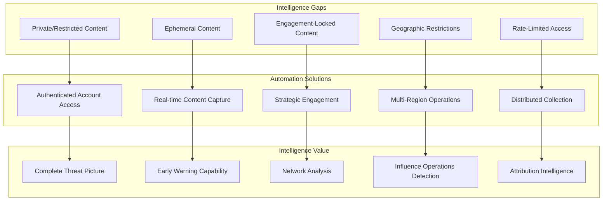
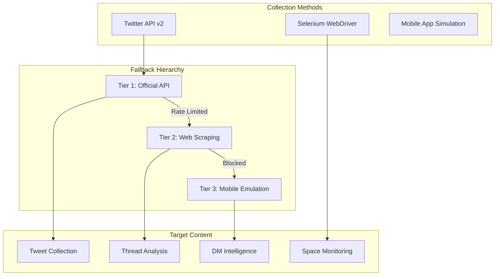
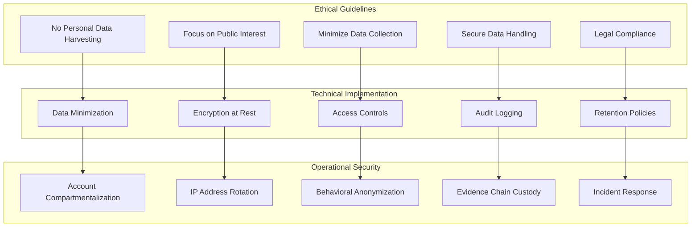
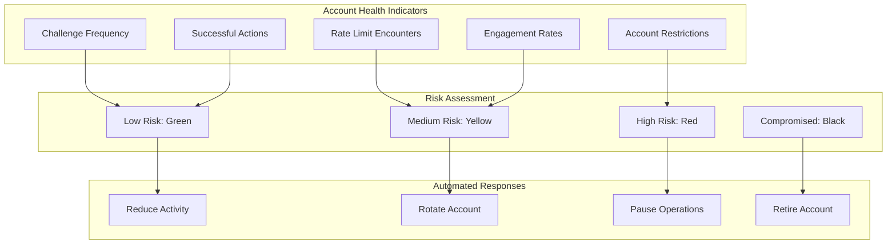
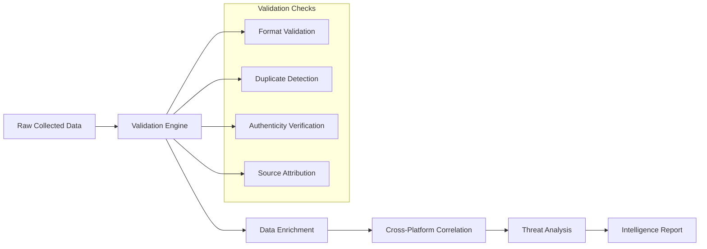

# Social Media Automation Strategy

## Overview

The Anti-India Campaign Detection System employs automated real account operations across Telegram, Instagram, and Twitter to gather intelligence from public and restricted content. This approach follows industry-standard practices used by cybersecurity agencies and intelligence organizations for accessing encrypted or heavily secured platforms while maintaining compliance with platform Terms of Service.

## Strategic Rationale

### Why Account Automation?



### Limitations of Public APIs

| Platform | API Limitations | Automation Benefits |
|----------|-----------------|-------------------|
| **Instagram** | • No Story API access<br/>• Limited private content<br/>• Restricted hashtag data | • Full story monitoring<br/>• Private account access<br/>• Complete hashtag intelligence |
| **Twitter** | • Rate limits (300 requests/15min)<br/>• Limited historical data<br/>• No DM access | • Unlimited web scraping<br/>• Full timeline access<br/>• DM monitoring capability |
| **Telegram** | • No private group access<br/>• Limited channel history<br/>• No user behavior data | • Private group infiltration<br/>• Complete message history<br/>• User interaction analysis |

## Platform-Specific Automation Strategies

### Instagram Automation Strategy

#### Account Pool Management
```mermaid
graph LR
    subgraph "Account Types"
        PRIMARY[Primary Accounts]
        BACKUP[Backup Accounts]
        SPECIALIZED[Specialized Accounts]
    end
    
    subgraph "Account Characteristics"
        AGED[Aged Accounts (>6 months)]
        VERIFIED[Email/Phone Verified]
        ACTIVE[Regular Activity History]
        DIVERSE[Geographic Diversity]
    end
    
    subgraph "Rotation Strategy"
        SCHEDULE[Rotation Schedule]
        HEALTH[Health Monitoring]
        REPLACEMENT[Replacement Pipeline]
    end
    
    PRIMARY --> AGED
    BACKUP --> VERIFIED
    SPECIALIZED --> ACTIVE
    AGED --> SCHEDULE
    VERIFIED --> HEALTH
    ACTIVE --> REPLACEMENT
```

#### Story Intelligence Operations
```python
class InstagramStoryIntelligence:
    def __init__(self):
        self.story_archive = {}
        self.ocr_engine = OCRProcessor()
        self.metadata_extractor = MetadataExtractor()
    
    async def monitor_target_stories(self, targets: List[str]):
        """Monitor stories from target accounts with rotation"""
        for target in targets:
            account = self.get_available_account()
            
            try:
                # Check for new stories
                stories = account.client.user_stories(target)
                
                for story in stories:
                    if story.id not in self.story_archive:
                        # Archive before expiration
                        story_data = await self.archive_story(story)
                        
                        # Extract intelligence
                        text_content = self.ocr_engine.extract_text(story.media_url)
                        metadata = self.metadata_extractor.process(story)
                        
                        # Store with timestamp
                        intelligence_report = {
                            'story_id': story.id,
                            'username': target,
                            'media_url': story.media_url,
                            'text_content': text_content,
                            'timestamp': story.taken_at,
                            'metadata': metadata,
                            'collection_account': account.username
                        }
                        
                        self.store_intelligence(intelligence_report)
                        
            except InstagramChallengeRequired:
                self.handle_account_challenge(account)
            except RateLimitError:
                self.rotate_to_next_account()
```

### Twitter Automation Strategy

#### Multi-Modal Collection Approach


#### Real-time Stream Processing
```python
class TwitterStreamIntelligence:
    def __init__(self):
        self.api_client = self.create_api_client()
        self.selenium_backup = SeleniumTwitterClient()
        self.stream_rules = []
    
    def setup_filtered_stream(self, keywords: List[str], accounts: List[str]):
        """Setup Twitter filtered stream for real-time monitoring"""
        # Create stream rules
        keyword_rule = " OR ".join(keywords)
        account_rule = " OR ".join([f"from:{acc}" for acc in accounts])
        
        rules = [
            tweepy.StreamRule(keyword_rule, tag="keywords"),
            tweepy.StreamRule(account_rule, tag="accounts")
        ]
        
        self.api_client.add_rules(rules)
        
    async def process_realtime_tweets(self, tweet):
        """Process incoming tweets from filtered stream"""
        # Extract intelligence
        intelligence = {
            'tweet_id': tweet.id,
            'text': tweet.text,
            'author_id': tweet.author_id,
            'created_at': tweet.created_at,
            'public_metrics': tweet.public_metrics,
            'context_annotations': tweet.context_annotations,
            'thread_id': self.extract_thread_id(tweet),
            'collection_timestamp': datetime.utcnow()
        }
        
        # Analyze for immediate threats
        threat_score = self.threat_analyzer.score_tweet(tweet.text)
        if threat_score > 0.7:
            self.trigger_alert(intelligence, threat_score)
            
        # Store for analysis
        await self.store_tweet_intelligence(intelligence)
        
        # If part of thread, collect full conversation
        if intelligence['thread_id']:
            await self.collect_thread_conversation(intelligence['thread_id'])
```

### Telegram Automation Strategy

#### Enhanced Channel Monitoring
```python
class TelegramAdvancedClient:
    def __init__(self):
        self.primary_client = TelegramClient('session', api_id, api_hash)
        self.honeypot_clients = []  # Multiple persona accounts
        
    async def comprehensive_channel_monitoring(self, channels: List[str]):
        """Enhanced channel monitoring with metadata extraction"""
        for channel in channels:
            try:
                # Get channel entity
                entity = await self.primary_client.get_entity(channel)
                
                # Monitor new messages
                async for message in self.primary_client.iter_messages(
                    entity, limit=None, reverse=True, 
                    offset_date=self.get_last_processed_date(channel)
                ):
                    
                    intelligence = await self.extract_full_intelligence(message)
                    await self.process_message_intelligence(intelligence)
                    
            except ChannelPrivateError:
                # Attempt honeypot infiltration
                await self.attempt_private_channel_access(channel)
    
    async def extract_full_intelligence(self, message):
        """Extract comprehensive intelligence from Telegram message"""
        return {
            'message_id': message.id,
            'channel_id': message.peer_id.channel_id,
            'text': message.text,
            'date': message.date,
            'views': getattr(message, 'views', 0),
            'forwards': getattr(message, 'forwards', 0),
            'replies': await self.count_replies(message),
            'media': await self.process_media(message.media),
            'sender_info': await self.analyze_sender(message.from_id),
            'reactions': await self.extract_reactions(message),
            'thread_info': await self.analyze_thread_context(message)
        }
```

## Compliance and Legal Framework

### Terms of Service Compliance

#### Platform-Specific Guidelines

| Platform | Compliance Strategy | Risk Mitigation |
|----------|-------------------|-----------------|
| **Instagram** | • Use official instagrapi library<br/>• Respect rate limits<br/>• Human-like behavior patterns | • Account rotation<br/>• Proxy usage<br/>• Challenge handling |
| **Twitter** | • Primary API usage<br/>• Selenium as backup only<br/>• Respect robots.txt | • Official API first<br/>• Ethical scraping practices<br/>• Rate limiting |
| **Telegram** | • Official Telethon library<br/>• Respect flood limits<br/>• No spam behavior | • Session management<br/>• Proper authentication<br/>• Error handling |

### Ethical OSINT Principles



## Anti-Detection Measures

### Human Behavior Simulation

```python
class HumanBehaviorSimulator:
    def __init__(self):
        self.action_patterns = self.load_behavior_patterns()
        self.timing_profiles = self.load_timing_profiles()
    
    def simulate_human_scrolling(self, driver):
        """Simulate realistic scrolling patterns"""
        scroll_patterns = [
            self.slow_scroll_with_pauses,
            self.quick_scroll_with_backtrack,
            self.section_by_section_scroll
        ]
        
        pattern = random.choice(scroll_patterns)
        pattern(driver)
    
    def randomized_action_delays(self):
        """Generate human-like delays between actions"""
        base_delay = random.uniform(1.5, 4.5)  # Base human reaction time
        fatigue_factor = random.uniform(0.8, 1.3)  # Fatigue simulation
        distraction_chance = random.random()
        
        if distraction_chance < 0.1:  # 10% chance of distraction
            base_delay += random.uniform(5, 15)
            
        return base_delay * fatigue_factor
    
    def generate_realistic_typing(self, text: str):
        """Simulate realistic typing patterns"""
        typed_text = ""
        for char in text:
            typed_text += char
            
            # Typing speed variation
            delay = random.uniform(0.05, 0.2)
            
            # Occasional typos and corrections
            if random.random() < 0.02:  # 2% typo chance
                typed_text += random.choice('abcdefghijklmnopqrstuvwxyz')
                time.sleep(delay * 2)
                typed_text = typed_text[:-1]  # Backspace
                
            time.sleep(delay)
            
        return typed_text
```

### Fingerprint Randomization

```python
class BrowserFingerprintRandomizer:
    def create_randomized_browser(self):
        """Create browser with randomized fingerprint"""
        options = webdriver.ChromeOptions()
        
        # Randomize user agent
        user_agents = self.load_user_agent_pool()
        selected_ua = random.choice(user_agents)
        options.add_argument(f'--user-agent={selected_ua}')
        
        # Randomize viewport size
        viewports = [(1920, 1080), (1366, 768), (1440, 900), (1536, 864)]
        width, height = random.choice(viewports)
        options.add_argument(f'--window-size={width},{height}')
        
        # Randomize timezone
        timezones = ['America/New_York', 'Europe/London', 'Asia/Tokyo']
        options.add_argument(f'--timezone={random.choice(timezones)}')
        
        # Disable automation indicators
        options.add_experimental_option("excludeSwitches", ["enable-automation"])
        options.add_experimental_option('useAutomationExtension', False)
        
        return webdriver.Chrome(options=options)
```

## Account Safety Protocols

### Health Monitoring System



### Account Recovery Procedures

```python
class AccountRecoverySystem:
    def handle_instagram_challenge(self, account, challenge_type):
        """Handle Instagram security challenges"""
        if challenge_type == "phone_verification":
            return self.handle_phone_verification(account)
        elif challenge_type == "email_verification":
            return self.handle_email_verification(account)
        elif challenge_type == "photo_verification":
            return self.handle_photo_verification(account)
        else:
            self.quarantine_account(account)
            
    def handle_twitter_suspension(self, account):
        """Handle Twitter account restrictions"""
        suspension_reason = self.analyze_suspension(account)
        
        if suspension_reason == "automation_detected":
            self.reduce_activity_level(account)
            self.schedule_appeal(account)
        elif suspension_reason == "spam_behavior":
            self.review_engagement_strategy(account)
            self.implement_behavioral_changes(account)
```

## Intelligence Quality Assurance

### Data Validation Pipeline



This automation strategy ensures comprehensive intelligence collection while maintaining operational security, legal compliance, and ethical standards. The multi-layered approach provides resilient coverage across all major social media platforms used for anti-India campaign coordination.
